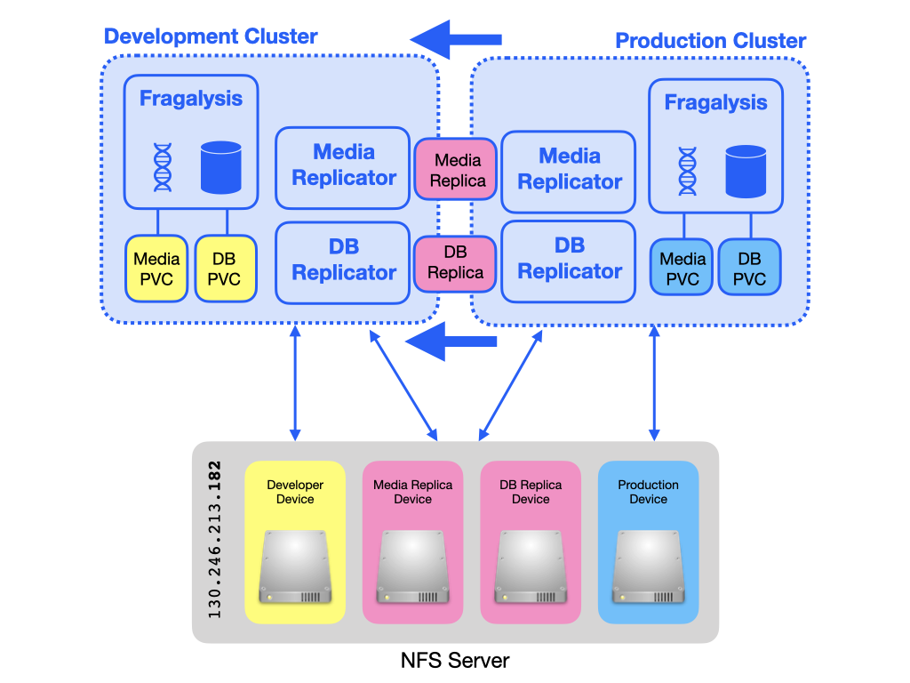
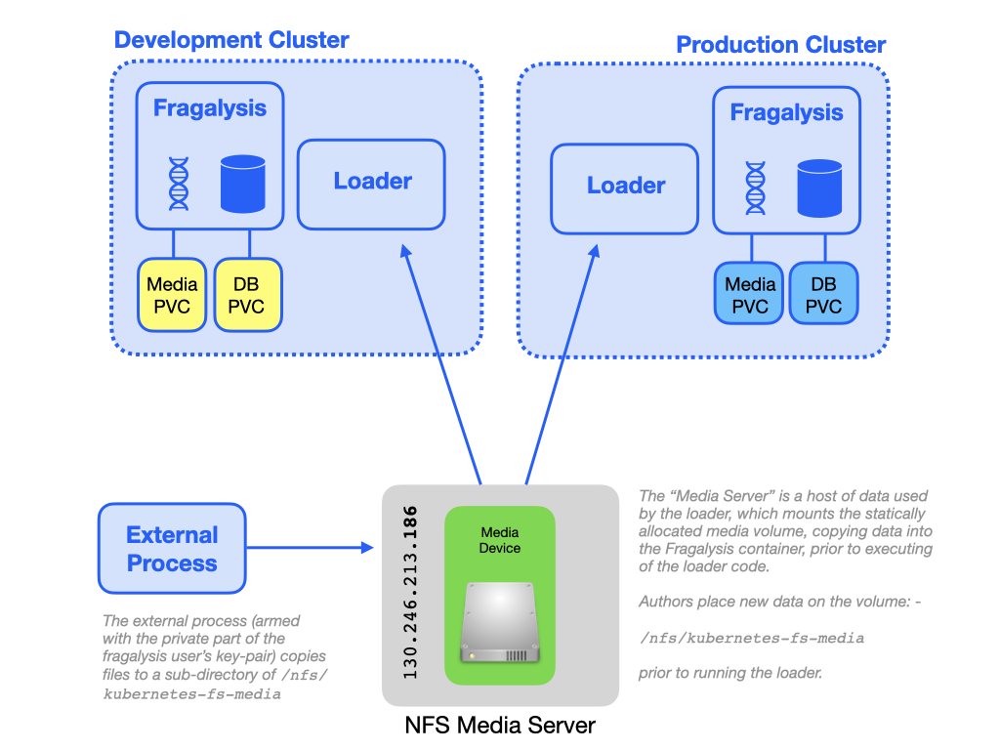

###############
The NFS Servers
###############

There is an NFS server to provide dynamic provisioning and shared (replication)
volumes for both the **DEVELOPMENT** and **PRODUCTION** clusters. An separate
NFS sever also exists to provide a a volume for Fragalysis (Django) **Media**
files, used by the Media Loader AWX jobs.

*************************
The Dynamic Volume Server
*************************

This is a ``c2.large`` (8 core, 8Gi) instance type with Floating IP
``130.246.213.182`` that has two attached volumes that act as roots for
the respective cluster's NFS provisioner. All application-based NFS volumes
(the Kubernetes **Persistent Volume Claims**) are served from one of the devices
(one device dedicated to the development cluster and one for production
cluster).

Two more volumes are used to provide static exports for the production
media and database replicas.

An AWX job launches a CronJob that replicates the production media
(using rsync) and database (using pg_dump) to the
static volumes. These replicas form the basis of the re-import into
the Staging stack and any User stack that requires them.

..  warning::
    Media replication is no longer used. The ability replicate media data
    between servers was removed on 25 May 2021.
    The documentation remains for historical reference purposes only.

******************************
The Static Media Volume Server
******************************

..  warning::
    The Static Media Volume Server is no longer used. The ability to load
    media files directly from a NFS volume was removed on 25 May 2021.
    The documentation remains for historical reference purposes only.

This is a ``m1.large`` (2 core, 8Gi) instance type with Floating IP
``130.246.213.186`` that has one attached volume that acts as static root
for new Fragalysis (Django) **Media** data.

A user deposits new files onto the NFS export (the *External Process*)
for use by *Loader* Jobs in production, staging and user stacks.

********************
Creating the servers
********************

The servers were instantiated manually using the STFC/OpenStack console and
then configured using the ``site-nfs.yaml`` and ``site-nfs-media.yaml``
plays in the root of this project.

This repository should be cloned to the STFC project bastion machine.

The Dynamic Volume Server
=========================

1.  Using the STFC/OpenStack Console...

    1.  Create an NFS server instance
    2.  Create four suitably sized volumes and attach them to the NFS server.
        There is a volume for dynamic allocation of development and production
        cluster volumes (say 4TB each), a volume for the media replica (say 100Gi)
        and one for the database replica (say 100Gi)
    3.  Attach the designated floating IP (``130.246.213.182``)

2.  Review the ``site-nfs.yaml`` file and ensure the various ``device:``
    values are correct (i.e. the device mappings are what you expect)
3.  From the bastion machine run the playbook
    (i.e. run ``ansible-playbook site-nfs.yaml``)

With this done your NFS server should be available from either cluster.

The Static Volume Server
========================

1.  Using the STFC/OpenStack Console...

    1.  Create an NFS server instance
    2.  Create a suitably sized volume (say 1TB) and attach it to the NFS server
    3.  Attach the designated floating IP (``130.246.213.186``)

2.  Review the ``site-nfs-media.yaml`` file and ensure the ``device:``
    value is correct (i.e. the device mapping is what you expect)
3.  From the bastion machine run the playbook
    (i.e. run ``ansible-playbook site-nfs-media.yaml``)

With this done your NFS server should be available from either cluster.

****************
Volume Snapshots
****************

A *Scheduled* AWX Job Template runs regularly [#f1]_ to create volume snapshots
of the *key* NFS volumes. These snapshots are not guaranteed to be re-usable,
especially of the data on them was being modified during the snapshot (which
is why snapshots are taken at an obscure time). The snapshots are made
in the event of disaster recovery. Data should always be backed up
separately.

The AWX Job that's responsible for creating volume snapshots (which runs
on the **DEVELOPER** cluster) is: -

*   **Maintenance Volume Snapshot**

It is driven by the ``snapshot_volumes`` Ansible variable, a list of
volume names in the **xchem-follow-up** Project. The default value of the
variable is::

    snapshot_volumes:
    - kubernetes-nfs-dev-dynamic
    - kubernetes-nfs-prod-dynamic
    - kubernetes-nfs-frag-stack-media

Once a snapshot is made the playbook removes others older than 6 days so,
in the default setup, only one snapshot is maintained.

.. rubric:: Footnotes

.. [#f1] At 04:04 on Sundays at the time of writing.
