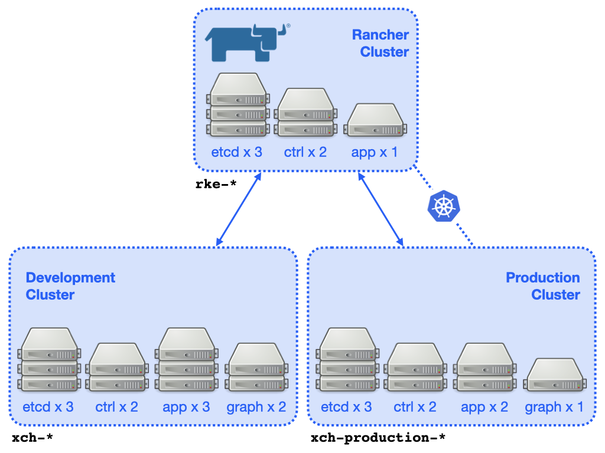
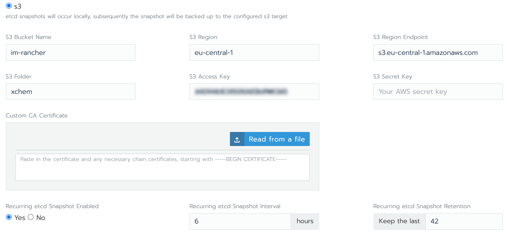

##################
The Rancher Server
##################

The **DEVELOPMENT** and **PRODUCTION** clusters have been created with
and are managed by `Rancher`_, deployed to the STFC/OpenStack cluster
on a dedicated kubernetes cluster configured using `RKE`_: -

`https://rancher-xchem.informaticsmatters.org <https://rancher-xchem.informaticsmatters.org>`_

...where you will need suitable credentials in order to log-in.

A simplified depiction of the clusters can be seen in this diagram.
Each cluster consists of key ``etcd`` and ``control plane`` nodes
and various worker (``app`` and ``graph``) nodes. The instances are created
and managed by the Rancher server.

A full description of the Rancher installation and its configuration
can be found in the following external (GoogleDoc) document: -

*   `OpenStack K8S clusters with Rancher`_ (AWS)

..  warning::

    The cluster instances are created automatically by the Rancher server.
    **DO NOT edit or delete any compute instance that may be a Rancher-managed
    Kubernetes instance via the STFC/OpenStack console**. To help you identify
    them the instances use a naming convention. In our case instance names
    that belong the the cluster hosting Rancher begin ``rke-``. Instance names
    that belong to the **DEVELOPMENT** or **PRODUCTION** cluster begin ``xch-``.

********************
Cluster etcd backups
********************

All Kubernetes objects are stored on `etcd`_. Periodically backing up the etcd
cluster data is important to recover Kubernetes clusters under disaster
scenarios, such as losing all master nodes. The snapshot file contains all
the Kubernetes states and critical information.

The backup of etcd for the RKE and Application clusters is automated using
features built-in to RKE and Rancher, with snapshots written to an Informatics
Matters AWS S3 bucket (detailed in the following sections).

.. epigraph::

    The credentials used to create AWS S3 backups are those of the user
    ``fragalysis-loader`` on the Informatics Matters AWS account. The
    secret access key is stored in the Informatics Matters `KeePassXC`_
    application (under ``AWS -> AWS S3 (Fragalysis) User``).

Application clusters
====================

A snapshot of each cluster's etcd content is configured to occur regularly
with the local copy also copied to an Informatics Matters AWS S3 target
in the ``eu-central-1`` region.

Backups of the application clusters is performed by Rancher.

Typical automated AWS S3 backup settings are illustrated in the following
Rancher cluster configuration screenshot: -

Cluster bucket and path details are as follows: -

*   The **PRODUCTION** cluster's etcd is backed up to
    ``im-rancher/xchem-production``. This occurs every 6 hours and
    28 copies are kept (a 7-day approximate history)
*   The **DEVELOPMENT** cluster's etcd is backed up to
    ``im-rancher/xchem``. This occurs every 6 hours and
    42 copies are kept (a 10-day approximate history)

Individual backup file size [#f1]_ is approximately 7MB for **DEVELOPMENT**
and 21MB for **PRODUCTION**.

Rancher (RKE) cluster
=====================

The etcd material for the RKE-formed Kubernetes cluster that hosts the Rancher
server is also backed up. This backup is performed by RKE and configured using
the RKE ``cluster.yml``, which can be found in the ``rancher`` directory of the
Fragalysis `deployment repository`_.

Cluster bucket and path details are as follows: -

*   The **RKE** cluster's etcd is backed up to
    ``im-rancher/rancher-xchem``. This occurs every 6 hours and
    21 copies are kept (a 5-day approximate history)

Individual backup file size [#f1]_ is approximately 8MB, with 3 files
created per backup.

For details of backup configuration refer to the `Rancher RKE backup`_
documentation.

*********************
Cluster etcd recovery
*********************

Application clusters
====================

Restoring an application cluster (**PRODUCTION** or **DEVELOPMENT**)
from a backup is relatively straightforward. It can be
done from within the Rancher console for the chosen cluster.

Follow the Rancher `Restoring a Cluster from Backup`_ documentation,
remembering that we're using a post v2.4.0 Rancher installation.

Rancher (RKE) cluster
=====================

Restoring the RKE-based cluster is a little more complicated, compared to
restoring an application cluster, and you should follow the Rancher
`Restoring Backups—Kubernetes`_ installs documentation, following the
appropriate S3-based instructions.

Some `example RKE scenarios`_ are illustrated [#f2]_.

.. _deployment repository: https://github.com/InformaticsMatters/dls-fragalysis-stack-kubernetes
.. _etcd: https://etcd.io
.. _example rke scenarios: https://rancher.com/docs/rke/latest/en/etcd-snapshots/example-scenarios/
.. _keepassxc: https://keepassxc.org
.. _rancher: https://rancher.com/products/rancher/
.. _restoring a cluster from backup: https://rancher.com/docs/rancher/v2.x/en/cluster-admin/restoring-etcd/
.. _restoring backups—kubernetes: https://rancher.com/docs/rancher/v2.x/en/backups/restorations/ha-restoration/
.. _rancher rke backup: https://rancher.com/docs/rancher/v2.x/en/backups/backups/ha-backups/
.. _rke: https://rancher.com/products/rke/
.. _OpenStack K8S clusters with Rancher: https://docs.google.com/document/d/15ffwm5daCW5gJ1ZNpX6A9mYP-rw3Bvyr9nZyiWKte00/edit?usp=sharing

.. rubric:: Footnotes

.. [#f1] July 2020

.. [#f2] We use RKE that's superior to v0.2.0
