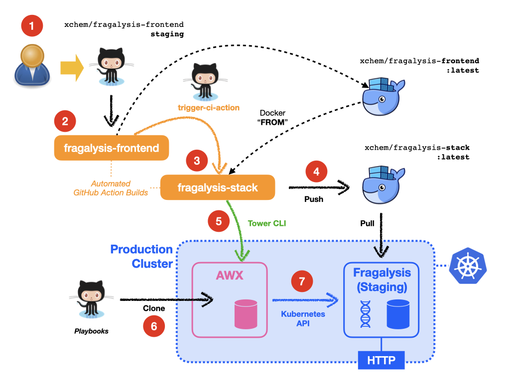

#####################
Continuous Deployment
#####################

.. epigraph::

    The Fragalysis Stack automated deployment mechanism
    and the role of GitHub `Actions`_ and `AWX`_.

***
AWX
***

Deployment relies on pre-configured Jobs on the corresponding cluster's
AWX server. For example, on the production cluster the continuous delivery
described below relies on the following **Job Templates** that can be executed
by the designated GitHub Action user (``github``): -

*   **Production Fragalysis Stack (Version Change)**
*   **Staging Fragalysis Stack (Version Change)**

Prior to automated deployment the user is expected to have deployed the
**Staging** and **Production** stacks using the following pre-configured
**Job Templates**: -

*   **Production Fragalysis Stack**
*   **Staging Fragalysis Stack**

These job templates are typically only executed once.

****************
Fragalysis Stack
****************

Automated deployment of the Fragalysis Stack is achieved through the `Actions`_
CI/CD framework and AWX. As changes are committed to the **master** branch
of the stack's GitHub repositories (``xchem/fragalysis-frontend``,
``xchem/fragalysis-backend`` and the ``xchem/fragalysis-stack`` itself) GitHub
launches runs the build instructions in the CI located in each project's
corresponding **workflow** file.

As an example, a typical sequence of *actions* that occur in response to a
commit to the **staging** branch of ``xchem/fragalysis-frontend`` repository can
be seen illustrated in the following diagram and described below: -

Deployment actions (from commits)
=================================

Although GitHub launches a build for every change (regardless of branch)
the automated actions shown above and described here only take place when
a repository's **staging** branch changes (or is tagged).

1.  A user accepts a *Pull Request* or makes a direct change on the ``staging``
    branch to the ``frontend`` code.

2.  A few moments later GitHub detects the change, clones the Frontend code
    and executes the commands in its **workflow**. This results in a new
    ``fragalysis-frontend:latest`` container image being pushed to Docker Hub.

3.  On success, the Frontend build's instructions **trigger** the Stack's
    GitHub build. [#f1]_

4.  The by-product of the Stack build is the ``fragalysis-stack`` container
    image. Here we see the ``latest`` tag being used.

5.  At the end of a successful Stack build, and a new ``latest`` image pushed
    to Docker Hub, the Stack **workflow** has an instruction to
    **trigger** the launch of a pre-existing **Job Template** in the AWX server.
    This is achieved through the use of our `trigger-awx-action`_. The Job's
    *name* is injected into the build using a GitHub Repository Secret.

    The Action waits for the AWX Job **Staging Fragalysis Stack (Version Change)**
    AWX **Job Template** to complete.

6.  The AWX **Job Template** executes.

7.  **Job Template** execution, using the Ansible built-in **k8s** module, results in a
    forced redeployment of the Stack's **Pods** (managed as a `StatefulSet`_).
    The **Pods** restart one-by-one in an orderly fashion until all have
    been replaced using a fresh pull of the ``latest`` container images.
    This roll-out strategy should prevent any break in service.

Steps 2 to 7 above also take place when commits are made to the
``fragalysis-backend`` repository.

Every change to the Stack's ``master`` branch results in the execution
of the following AWX Job Template (on the **PRODUCTION** cluster's AWX server): -

*   ``Staging Fragalysis Stack (Version Change)``

Every production-grade **Tag** [#f2]_ on the Stack repo results in the
execution of the following AWX Job Template (on the **PRODUCTION** cluster's
AWX server): -

*   ``Production Fragalysis Stack (Version Change)``

Performance
===========

The time between a commit to the Frontend repository and the start of the
roll-out of the changes in the cluster is around **8 or 9 minutes**. Each
Stack Pod takes around 3 minutes before it's providing a service endpoint.

In summary a typical re-deployment will take around **15 minutes**.

.. rubric:: Footnotes

.. [#f1] The build knows that the stack needs to be built because this
         dependency is *hard-coded* into the Frontend's **workflow**.

.. [#f2] A tag like ``1.0.3``, one that has three numbers separated by
         a period.

.. _awx: https://github.com/ansible/awx
.. _cli: https://pypi.org/project/ansible-tower-cli/
.. _statefulset: https://kubernetes.io/docs/concepts/workloads/controllers/statefulset/
.. _actions: https://github.com/features/actions
.. _trigger-ci-action: https://github.com/InformaticsMatters/trigger-ci-action
.. _trigger-awx-action: https://github.com/InformaticsMatters/trigger-awx-action
