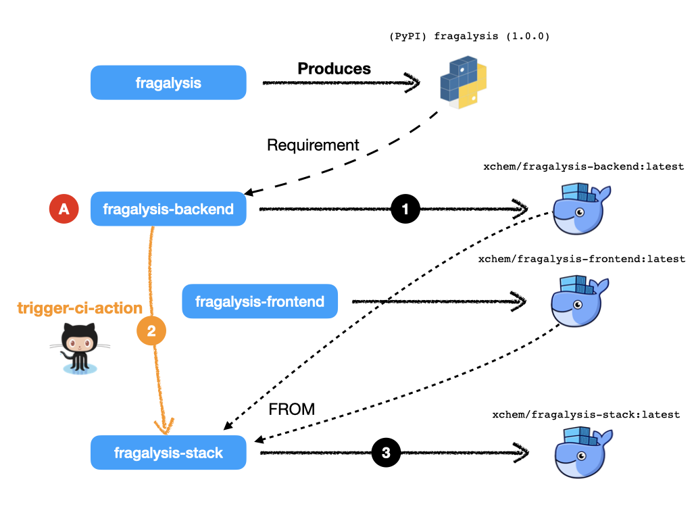
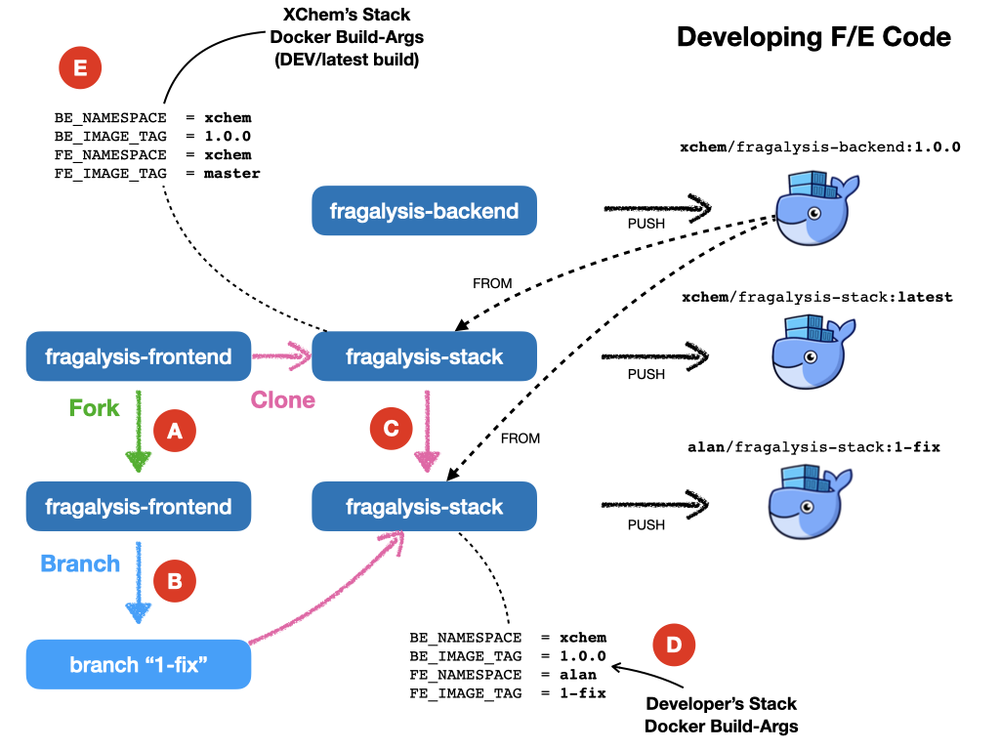
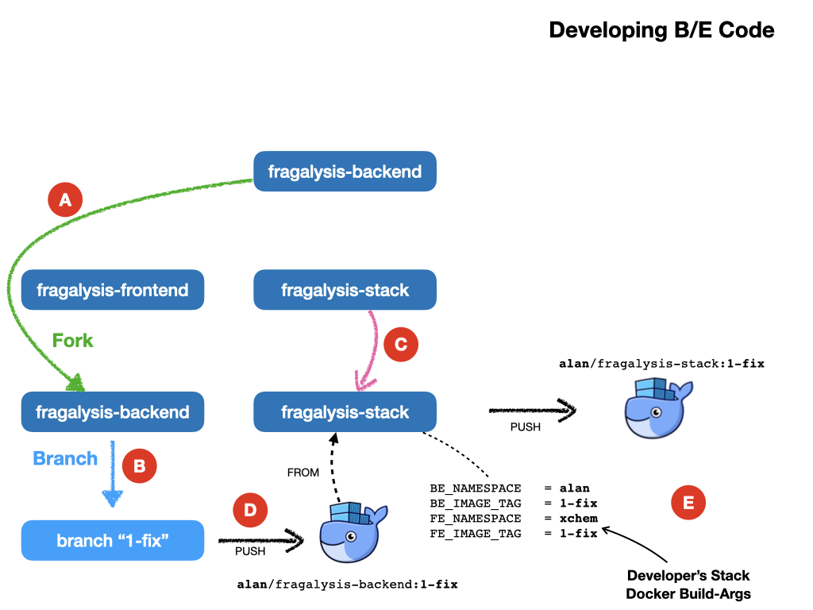
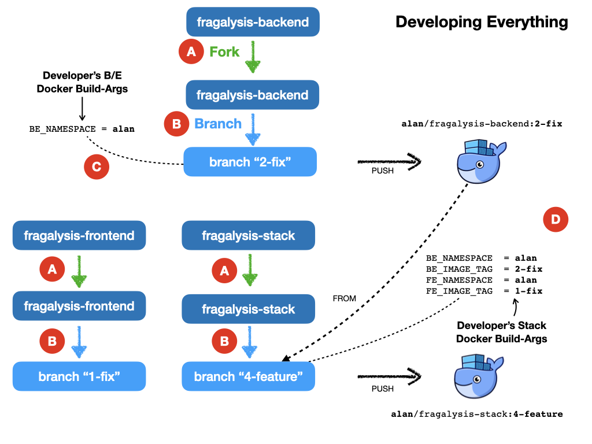

######################
Continuous Integration
######################

.. epigraph::

    Fragalysis Stack development procedures for Kubernetes deployment
    and the role of GitHub `Actions`_ in the Fragalysis Stack *CI* process.

We rely on an external build process (**GitHub Actions**) to
build, test and deploy the Fragalysis Stack container images.

**GitHub Actions** are a built-in feature of GitHub repositories.

We have added facilities to *chain* builds (for one GitHub repository
to trigger another) using our custom `trigger-ci-action`_
GitHub Action. We deploy container images to the cluster using
pre-configured AWX **Job Templates** using our custom `trigger-awx-action`_
GitHub Action.

*****************************
Fragalysis Stack Repositories
*****************************

There are four GitHub repositories involved in the build of the stack image::

    fragalysis
    fragalysis-backend
    fragalysis-frontend
    fragalysis-stack

The by-product of each repository is: -

fragalysis
    The output of the ``fragalysis`` repository is a small package of
    Python code, written to `PyPI`_ when the repository is tagged. The package
    is part of the ``fragalysis-backend`` image's Python *requirements* [#f1]_.

fragalysis-backend
    The output of the ``fragalysis-backend`` is a container image, written to
    `Docker Hub`_. This image is used as a ``FROM`` image in the
    *Stack* `multi-stage build`_. The backend is based on a **Python**
    "slim-bullseye" image.

fragalysis-frontend
    The output of the ``fragalysis-frontend`` is a container image, written to
    `Docker Hub`_. This image is used as a ``FROM`` image in the
    *Stack* `multi-stage build`_. The frontend is based on a **Node**
    "bullseye" image.

fragalysis-stack
    The output of the ``fragalysis-stack`` is a container image, written to
    `Docker Hub`_, and is based on the content of both the
    frontend and backend images.

****************************
Build example (stack master)
****************************

Let's see how **GitHub Actions** work for the Fragalysis Stack by exploring
a simple example, where a user-change to a repository's *staging* branch
results in the stack being re-built, illustrated by the following diagram.

The diagram illustrates a *user* making a change (**A**) to the
``staging`` branch of ``fragalysis-backend`` repository. The following steps
occur, in approximate order: -

1.  **GitHub Actions** detect the change and a build takes place
    that results in a backend image build pushed to `Docker Hub`_.
    The image pushed is ``xchem/fragalysis-backend:latest``.

2.  At the end of the backend build the **Action** *triggers* a build in the remote
    repository ``fragalysis-stack``. It uses our `trigger-ci-action`_ Action to do this.

3.  The ``fragalysis-stack`` **Actions** (triggered by the
    *backend* changes above) runs a build and its image is pushed to Docker Hub.
    The backend image is based on the contents of both the backend and frontend
    container images. The image pushed is ``xchem/fragalysis-stack:latest``.

Importantly, there is only one branch in the stack repository, ``master``.

********************************
More scenarios (here be Dragons)
********************************

That's a simplistic illustration of a *build chain* from one ``staging``
branch rippling through the dependent repositories.

But software development's more complicated than just changes to the
``staging`` branch and, in these cases, **GitHub Actions** will need some help.

How does the Action know which repos to trigger?
================================================

This is the responsibility of the repository owner. Our `trigger-ci-action`_
Action is used to simplify the calls the the **GitHub** API but the
owner of each repository needs to know which repositories to trigger
and simply uses the `trigger-ci-action`_ at a suitable point in their
own **workflow** file.

The mechanism is essentially a *push-driven* trigger from *upstream* repository
to *downstream*. A *downstream* repository cannot monitor *upstream*
repositories, the author has to know which repositories depend on their code.

How does a repo know what container tag to use?
===============================================

By convention, in a CI/CD sense, automated builds on ``staging`` produce
container images tagged ``latest``. The **Action** build can be easily
configured to produce any tag but we tend to use ``latest`` or
the tag used when a repository **Release** or **Tag** is created.

How do I instruct the downstream to use my image?
=================================================

In our example we've assumed the branch being manipulated is ``staging``
and in this *very simple* workflow we want all the dependent ``staging``
branches to build, resulting in their own ``latest`` images.

But what if you're working on a defect on the *backend*, on a branch
called ``issue-1178.1``? Do you want to trigger a rebuild of the *Stack*'s
``latest`` image from ``fragalysis-backend:latest``? No, you want the
stack to use ``fragalysis-backend:issue-1178.1`` as its ``FROM``.

So this is where the `trigger-ci-action`_ Acton, calling the **GitHub** REST API
and your **workflow** file in both your *upstream* and *downstream*
repositories become a little more complex...

The *downstream* (Stack) repository's **workflow** file is configured to
expect a ``workflow_dispatch`` event, the variables of which are populated
pu the upstream Action's use of its `trigger-ci-action`_.
There are default values, namely: -

*   ``BE_NAMESPACE`` AND ``BE_IMAGE_TAG`` (defaulting to ``xchem``
    and ``latest``)
*   ``FE_NAMESPACE`` AND ``FE_IMAGE_TAG`` (defaulting to ``xchem``
    and ``latest``)

All the *upstream* repository's **workflow** file has to do is ensure that
it *injects* appropriate values for these variables using the
`trigger-ci-action`_. For this example we'd set the variables::

    with:
      ci-inputs: >-
        be_namespace=issue-1178.1
        be_image_tag=xchem

With this setup the triggered build will produce a Stack image based on our
``issue-1178.1`` backend image.

Brilliant!

But hold on - the stack will be based on ``issue-1178.1`` while producing
its own ``latest`` image.

The stack's *downstream* repository's ``workflow_dispatch``
handler also accommodates the variables ``stack_namespace`` and ``stack_version``.
If you set these in your trigger action you can build a stack image
``alanbchristie/fragalysis-stack:issue-1178.1`` by setting the variables
``stack_namespace`` and ``stack_version`` to ``alanbchristie`` and
``issue-1178.1`` respectively.

Simple ... ish

But what if you forget to set the variable?
    After all, when you create your *backend* branch you need to adjust your
    own GitHub secrets to provide a value for the variable. If you forget
    (and you will) you'll end up causing a new build of ``latest`` in the
    downstream projects that contains your (probably untested) patch. Not what
    others might expect from ``latest``.

What if I want to trigger a non-master downstream branch?
=========================================================

..  epigraph::

    That's a very good question.

If I have a ``issue-1178.1`` branch in the *upstream* build and I want to trigger
the ``issue-1178.1`` branch in the *downstream* project?

It's solved by the `trigger-ci-action`_ Action, which allows you to pass in
a ``ci-ref`` definition so that **GitHub** builds the branch you name rather than
the default ``master``.

Brilliant!

If you're clever enough you could even pass this value on to *downstreams*
of the *downstream*, but that doesn't apply in our case and starts to get
complex very quickly.

But what if you forget to set the variable?
    Mmmm ... OK ... I see a pattern emerging here.

Basically this is where it all gets rather messy, complex and complicated
and unless you are very, very disciplined in your project organisation and
development you should be treading extremely carefully.

I have a fork of the frontend, how do I...
==========================================

Here we'd like changes in a branch of a fork of one repository
to trigger the build of a branch in the fork of another repository...

**STOP!** It's just getting mind-bendingly complex.

Mmmmm
    We're starting to sink deeper into a very complicated world.

**************************
Development Recommendation
**************************

For the main production images for STAGING (latest) and PRODUCTION (tagged)
we...

1.  ...utilise **trigger-ci-action** actions in the main ``xchem`` repositories.
    The build triggers are used *exclusively* for the automatic production of
    ``latest`` images on the ``master`` branch of the stack.

2.  Similarly, GitHub builds tagged images on the main ``xchem`` repositories
    based on the presence of a release (or tag) in the repository.
    ``fragalysis-backend:2023.11.1`` is automatically produced when the owner
    applies the tag ``2023.11.1`` to the ``fragalysis-backend`` repository.

The main stack deployment is therefore automatic, continuous, fast but,
above all, simple.

Individual developers...

3.  ...work on branches of the main repositories or (ideally) on branches of
    *forks* of the main repos.

4.  No images are automatically produced from changes to branches or forks.

5.  Developers are responsible for building their own container images
    and for pushing them to Docker Hub. **Tina** working on branch ``issue-1178.1``
    in a *fork* of the ``fragalysis-frontend`` repository is responsible
    for producing the corresponding ``stack`` image by (ideally) also forking
    and manipulating the ``fragalysis-stack`` repository so that it clones her
    frontend code rather than the code from ``xchem/fragalysis-frontend``.

6.  In order to deploy their project to Kubernetes (the subject of another guide),
    users may push their container image to any Docker Hub namespace, project
    or tag. **Tina** can push her image as ``xyz/stack-tina:issue-1178.1`` if she
    chooses. This works because she will have deployed her project to
    Kubernetes (now a developer responsibility) configured tso her cloud
    deployment's stack should run using the image ``xyz/stack-tina:issue-1178.1``
    (rather than the default ``xchem/fragalysis-stack:latest``). **Tina**
    can also select the version of the database she wants to use and the URL
    of the graph database. When she's done she destroys the Kubernetes project.

The above places significant responsibility on the developer - they have to
create the images, they have to push them, they have to create the Kubernetes
deployments (subject of another guide) and they have to understand the build
process.

But, this is a significantly simpler and a relatively pain-free route to
supporting unlimited multi-developer deployments than could be achieved by
any automatic system in the timescale available.

After all, if you're expect to have 20 or 30 developers all on different forks
and branches, all developing different aspects of the code, an automatic build
system would be enormously complex, fragile and costly to maintain.

********************
Development Examples
********************

To further illustrate the knock-on effect of the above recommendation
for individual developers, i.e. that developers are responsible for their own
container images using repository forks and branches, a few examples follow.

..  epigraph::

    The following relies on the use of standard Docker build arguments
    and the ability to use build-time args in the FROM statement,
    i.e. Docker v17.05 or later.

..  _fe-example:

Developing Front-end (F/E) Code Example
=======================================

Here you're developing front-end code, relying on a published backend image
and the existing stack implementation.

1.  The developer *forks* ``xchem/fragslysis-frontend``, into, say
    ``alan/fragslysis-frontend`` (**A**)
2.  The developer creates a *branch* and clones it, e.g. ``1-fix``,
    in order to make changes (**B**)
3.  The developer *clones* ``xchem/fragslysis-stack`` (**C**)
4.  When a stack image is to be tested the developer builds the stack
    (locally) using Docker. This could be achieved through the use of a
    build script [#f3]_) where the developer provides a suitable set of
    *build-args*, as shown (**D**).
5.  Upon conclusion of development a *pull-request* on the frontend repository
    propagates the changes back to the XChem repo.

The produced *stack*, built from a tagged backend and the code in
the developer's 1-fix branch of their front-end repo fork, can then be pushed
to Docker-hub and the Kubernetes cluster triggered to pull and run
the updated code.

The diagram also illustrates how the XChem ``STAGING/latest`` Fragalysis Stack
is built and deployed (automatically using GitHub). This *official* stack uses
a tagged b/e image (the same version in this example) but its *build args*
(**E**) are such that is uses the ``master`` branch of the ``xchem`` project
as the source of the front-end code [#f4]_.

..  _be-example:

Developing Back-end (B/E) Code Example
======================================

Here you're developing back-end code, relying on existing front-end and stack
implementation.

Here, in a less cluttered diagram: -

1.  The developer *forks* ``xchem/fragslysis-backend``, into, say
    ``alan/fragslysis-backend`` (**A**)
2.  The developer creates a *branch* and clones it, e.g. ``1-fix``,
    in order to make changes (**B**)
3.  The developer *clones* ``xchem/fragslysis-stack`` (**C**)
4.  When a stack image is to be tested the developer needs to build their own
    b/e image (**D**) (which they can optionally push to Docker hub) and then
    build the stack (locally), providing suitable *build-args*, as shown
    (**E**).
5.  Upon conclusion of development a *pull-request* on the b/e repository
    propagates the changes back to the XChem repo.

..  _stack-example:

Developing Stack Code Example
=============================

Here you're developing stack code, relying on a published back-end image
and front-end implementation.

1.  The developer *forks* the fragalysis stack repository (say to ``alan``)
    (**A**)
2.  The developer creates a *branch* and clones it, e.g. ``1-fix``,
    in order to make changes (**B**)
3.  When a stack image needs to be tested the developer needs to build their
    own stack image, which is pushed to Docker hub (**C**) providing suitable
    *build-args*, as shown (**D**).
4.  Upon conclusion of development  a *pull-request* on the stack repository
    propagates the changes back to the XChem repo.

..  _everything-example:

Developing Everything Example
=============================

Here you're developing front-end, back-end and stack code.

This is essentially a combination of the three prior scenarios.

1.  The developer *forks* each repository (say to ``alan``) (**A**)
2.  The developer creates a feature *branch* in each *fork* and then
    clones that to make changes (**B**). In the diagram we have branches
    ``1-fix``, ``2-fix`` and ``4-feature`` for the f/e, b/e and stack
    respectively.
3.  When a stack is to be tested the developer first builds their own b/e
    (**C**) using minimal build arguments [#f5]_. The user then builds their own
    stack, from a clone of their code branch. Here you can see the stack
    is configured to use the ``alan/fragalysis-backend:2-fix`` image
    and a clone of the f/e ``1-fix`` branch.
4.  The pushed stack can then be deployed to the Kubernetes cluster.
5.  Upon conclusion of development  *pull-requests* for b/e, f/e and stack
    repositories are made in order to propagate the changes back to the XChem
    repos.

.. rubric:: Footnotes

.. [#f1] Publishing to PyPi does not currently result in a trigger of the
         backend. It is something we can contemplate in the new development.

.. [#f3] The build script will help by forcing a pull of the
         dependent backend container image for example.

.. [#f4] ideally this would actually be a tag rather than ``master``

.. [#f5] Automation fo the image project from the project fork should be
         possible so the user may not have to specify anything in this case.

.. _actions: https://github.com/features/actions
.. _current: https://github.com/pavol-brunclik-m2ms/fragalysis-frontend/tree/develop
.. _docker hub: https://hub.docker.com/search?q=xchem&type=image
.. _multi-stage build: https://docs.docker.com/build/building/multi-stage
.. _pypi: https://pypi.org/project/fragalysis
.. _trigger-ci-action: https://github.com/InformaticsMatters/trigger-ci-action
.. _trigger-awx-action: https://github.com/InformaticsMatters/trigger-awx-action
