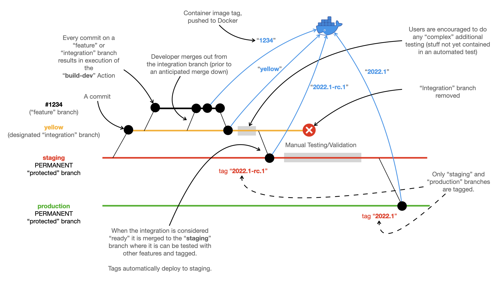
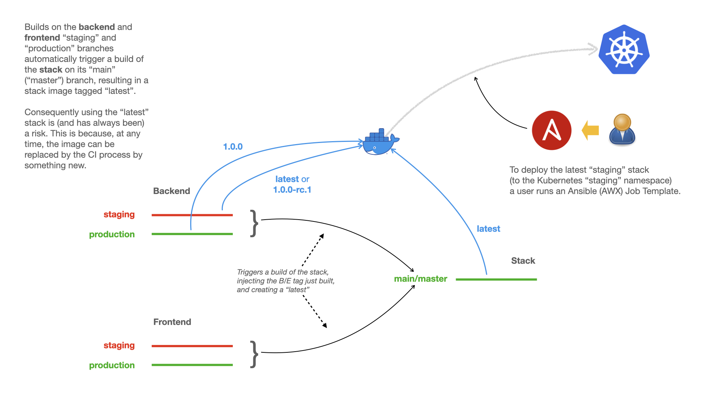

############################
New Branch Policy (Nov 2022)
############################

.. epigraph::

    The new branch and build policy introduced November 2022.

****
Why?
****

Prior to this we were building production stacks from frontend branches and
backend latest images. This is error-prone. Between the time taken to decide
to create a production image and actually creating one a new backend latest
stack could have been pushed or the frontend's branch could have changed.

By using tags from backend and frontend...

#.  We create a much more reliable and repeatable build process
#.  We have a clear reference to the underlying code for defect tracking

By using a staging branch in the backend and frontend we are able to safely
collect all the changes for the next release separately from the existing
production branch.

This allows us to make hot-fixes directly on or on branches created from the
current production branch without the risk of polluting the production release
with lots of other changes which are now confined to the staging branch

By using multiple "integration branches" (i.e. `yellow` and `blue`),
created from the staging branch, we are able to work on features that are
scheduled for different production releases simultaneously

.. epigraph::

    A little bit of extra work for increased reliability and traceability

*********************
Branch and tag policy
*********************

There are two **PERMANENT** (**protected**) branches in the backend repository.
A ``staging`` branch and a ``production`` branch.

You will also find one or more **integration** branches, used to integrate the
features for an active major/minor release. These might be used for milestones
and the naming is to be declared but it could be the milestone ``ms-2022-08-18``
or a more friendly name like the designated colour that's referred to during
meetings (``yellow``, ``purple``). So, if code for ms-2022-08-18 (yellow) is
being actively developed you might expect to find a ``yellow`` integration
branch.

Developers implement features (or fix bugs) on **feature** branches.

GitHub Actions result in new container images for: -

*   For every commit to a **feature**/**integration** branch
    (tagged using the branch name slug, i.e. yellow)
*   For every commit to the ``staging`` branch (tagged using latest)
*   For every non-production tag/release on the ``staging`` branch
*   For every production tag/release on the ``production`` branch

Summarised in the diagram below: -

Automated stack builds
======================

For every change to either the ``staging`` or ``production`` branch on the
**backend** (or **frontend**), a GitHub workflow Action triggers a build of the
**stack** image (in its repository) using the image just built in the backend.

Stack images built this way are launched by a user running a suitable
AWX Ansible Job Template.

As illustrated in the diagram below: -

Control variables
=================

For all this to work the **backend** repository needs access to a number of
control variables defined either as a GitHub Repository (or Organisational)
Secret or as part of a GitHub Environment.

.. epigraph::

    Refer to the build staging workflow for details of the expected variables
    and their expected origin (Secret or Environment).

To trigger a downstream build of the **stack** for example you will need to
define the following Secrets: -

*   ``TRIGGER_DOWNSTREAM`` (set to "yes")
*   ``STACK_USER``
    (A GitHub user account that build the stack)
*   ``STACK_USER_TOKEN``
    (A suitable "personal access token" for thew stack user account)

***********************************
How the automated stack build works
***********************************
The ``fragalayis-stack`` repository is triggered by certain builds in the
upstream repositories ``fragalysis-frontend` and ``fragalysis-backend``.
The build triggers are described below.

Frontend
========

Changes to staging branch
-------------------------
All changes on its **staging** branch are handled by its ``build-staging.yaml``
workflow. Pushes to the branch, excluding tags, result in a build that
eventually ends in running the **Trigger stack** step. This results in
triggering the fragalysis-stack ``build main`` workflow
(in the ``fragalysis-stack`` repository).

By default the frontend sends the following two important variable values to
the stack build. It triggers a stack build from the frontend code in this
branch and the backend code from the most recent (tagged) build -
i.e. the code in the most recent tag, captured in the ``stable`` image.

*    ``be_image_tag`` will have the value ``stable``
*    ``fe_branch`` will have the value ``staging``

Changes to the production branch
--------------------------------
Changes on its **production** branch are handled by its ``build-production.yaml``
workflow. Like the **staging** branch above it triggers a build in the stack
repository, sends the following two important variable values to the stack
build: -

*    ``be_image_tag`` will have the value ``stable``
*    ``fe_branch`` will have the value ``production``

Backend
=======
The backend repository build is slower than the frontend because the backend
is responsible for building the stack base container image. A number of
image tags are used, depending on which branch is being built.
Once the build is complete, like the frontend, the stack
repository build is triggered.

Changes to staging branch
-------------------------
All changes on its ``staging`` branch are handled by its ``build-staging.yaml``
workflow. Pushes to the branch, excluding tags, result in a build that
eventually ends in running the **Trigger stack** step.

On the staging branch the backend build a container image with the
Docker tag ``latest`` or the repository tag if the ``staging`` branch is tagged
(e.g. ``1.0.5-rc.1``).

By default the **backend** sends the following two important variable values
to the stack build: -

*   ``be_image_tag`` will have the value ``latest``
    Or the ``staging`` **tag** if the backend build on staging is the
    result of a tag.
*   ``fe_branch`` will have the value ``production``

The resultant **stack** image will be tagged ``latest``.

Changes to production branch
----------------------------
Changes on its ``production`` branch are handled by its ``build-production.yaml``
workflow. This workflow only runs when the backend production branch is tagged.

Like the **staging** branch above it triggers a build in the stack repository,
sending the following two important variable values to the stack build: -

*   ``be_image_tag`` will have the value of the **tag** applied to the backend
    production branch (e.g. ``1.0.5``)
*   ``fe_branch`` will have the value ``production``

The resultant **stack** image will be tagged ``latest``.

****************************
Manual building of the stack
****************************

The **backend** is the source of Django application that forms the *base image*
of the **stack**. The by-product of a backend build is a container image
pushed to Docker hub and it is this image that is the ``FROM`` image used
by the stack's ``Dockerfile``.

Building stacks for staging deployments
=======================================
Whenever the ``staging`` or ``production`` branch of the **backend** is built
it triggers a build of the **stack**, producing a stack image labelled ``latest``.
These ``latest`` images are manually deployed to the designated Kubernetes
namespace using a production cluster AWX Job Template.

.. epigraph::

    You *normally* do not need to build the stack, a ``latest`` version should
    have been built automatically from the most recent activity in either the
    **frontend** or **backed**.

When done deploy the stack using the appropriate AWX **Job Template**,
this is likely to be the template **Staging Fragalysis Stack (Version Change)**.
The ``stack_image_tag`` should already be set to ``latest``, the image
just built.

.. epigraph::

    An expert user could also simply delete the corresponding **Pod**
    (in the `staging-stack` **Namespace**) which will force Kubernetes to pull
    the new (``latest``) container image before starting running it.

Building stacks for production deployment
=========================================
When you want to build a **stack** for **production** (which will be
deployed automatically to the ``production-stack`` **Namespace** of the
production Kubernetes cluster) you **MUST**: -

#.  Decide which **backend** and **frontend** tags should be used to form
    the resultant stack image and then set the stack's repository **secrets**
    to these values
#.  Tag the stack repository with your chosen **stack** tag.

For example, to deploy a new production **stack** version ``2022.1`` based
on **backend** ``1.0.0`` and **frontend** ``4.5.0`` set (or update) the
following repository secrets: -

*   ``BE_IMAGE_TAG`` to ``1.0.0``
*   ``FE_BRANCH`` to ``4.5.0``

And then tag the stack repository's ``master`` branch with ``2022.1``.

The corresponding GitHub Action (in the stack repository) will ensure the new
production build is automatically deployed to the ``production-stack``
**Namespace** of the production Kubernetes cluster (using the Action's
**deploy-production** job).
