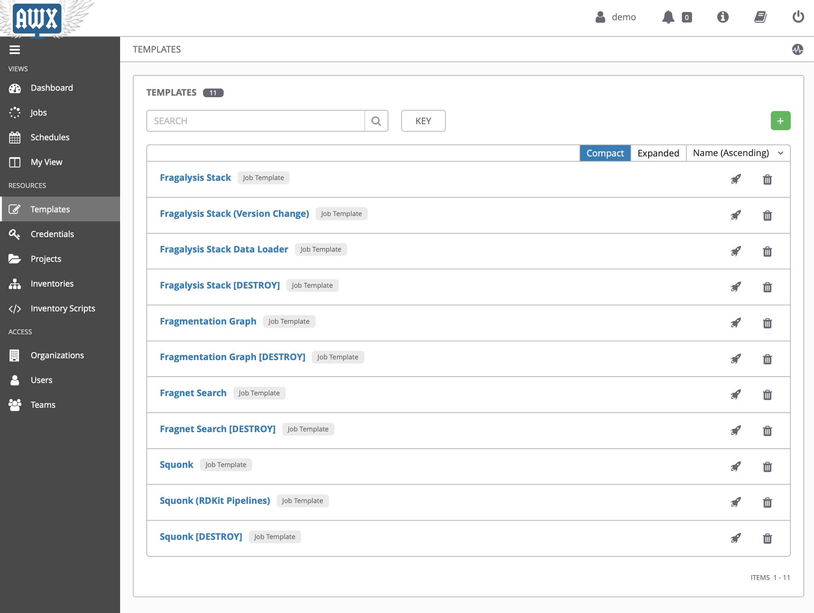

***************
Configuring AWX
***************

.. note:: Allow 5 minutes to complete this task,
          to configure and check the AWX application server

Configuration of the AWX server is achieved with the playbooks and roles
in the Informatics Matters `DLS Kubernetes`_ GitHub repository.

Clone the project and checkout the stable revision used for the demo::

    $ cd ~/Code/im-demo
    $ git clone https://github.com/InformaticsMatters/dls-fragalysis-stack-kubernetes.git
    $ cd dls-fragalysis-stack-kubernetes
    $ git checkout tags/2020.10
    $ pip install -r requirements.txt
    $ ansible-galaxy install -r role-requirements.yaml

The demo configuration will create the following objects: -

*   An organisation
*   Credentials
*   A team
*   A demo user
*   Inventories and Hosts
*   Projects
*   Job Templates

You can view the configuration using ansible vault::

    $ ansible-vault edit roles/awx-configuration/vars/config-demo.vault

Armed with the AWX ``admin`` user password used during the infrastructure
installation step above, you can now configure the AWX applications server
using its playbook, passing the password in via the command-line::

    $ ansible-playbook -e tower_password=<PASSWORD> \
            site-awx-configuration.yaml \
            --ask-vault-pass

If you login to the AWX server now using the ``demo`` user you should be able
to navigate to the Templates page and see all the available jobs, as
shown in this screenshot: -

.. _dls kubernetes: https://github.com/InformaticsMatters/dls-fragalysis-stack-kubernetes
