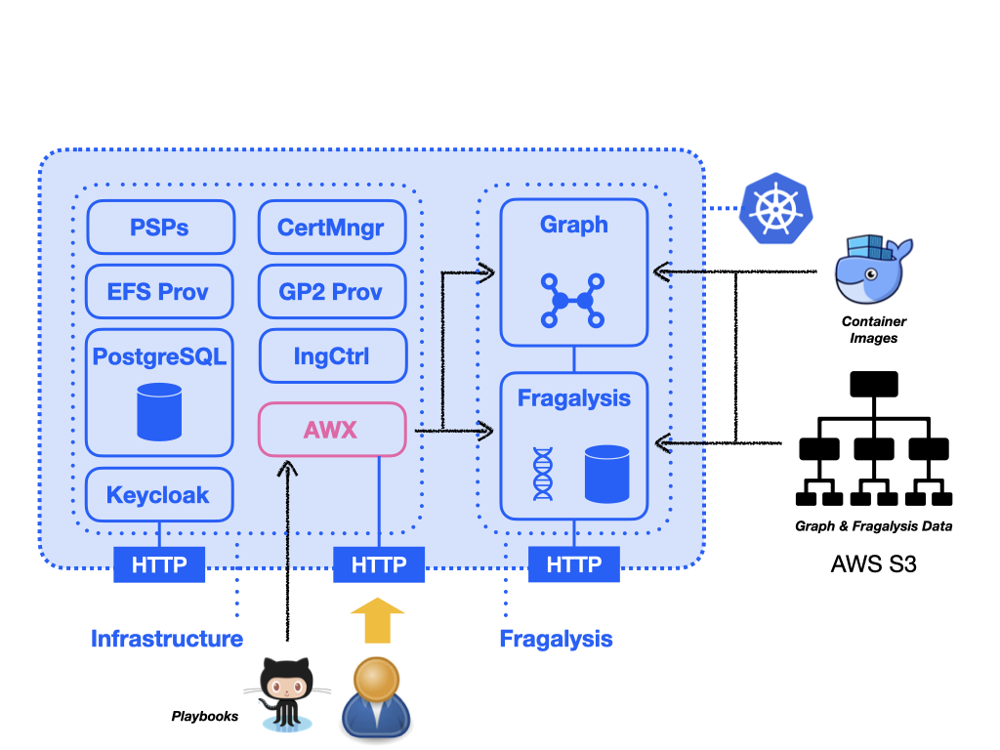

##############################################
Installation - Basic (Built-in Infrastructure)
##############################################

.. epigraph::

    This section documents the installation of Fragalysis on AWS (typically EKS).
    If you cannot deploy our validated infrastructure you should probably follow
    the approach described in :doc:`../basic-on-prem/index` . You will need to do
    this if you have an on-premises or restricted cluster.
    This might be because you are unable to install AWX (which pulls images from
    docker hub) or your security group rules prevent you from installing our EFS
    provisioner.

A *basic* cluster contains only the essential infrastructure components
to support the Fragalysis Stack and includes the deployment of a single,
production-grade (versioned), Stack.

The following schematic illustrates what we'll be installing, which includes
a number of infrastructure components as well as the Graph and Fragalysis
Stack: -

From this point we assume you have a viable cluster, what follows are
the steps required to deploy a single Fragalysis Stack and
associated Graph database to that cluster: -

..  toctree::
    :maxdepth: 1

    infrastructure-installation
    awx-configuration
    graph-deployment
    stack-deployment
