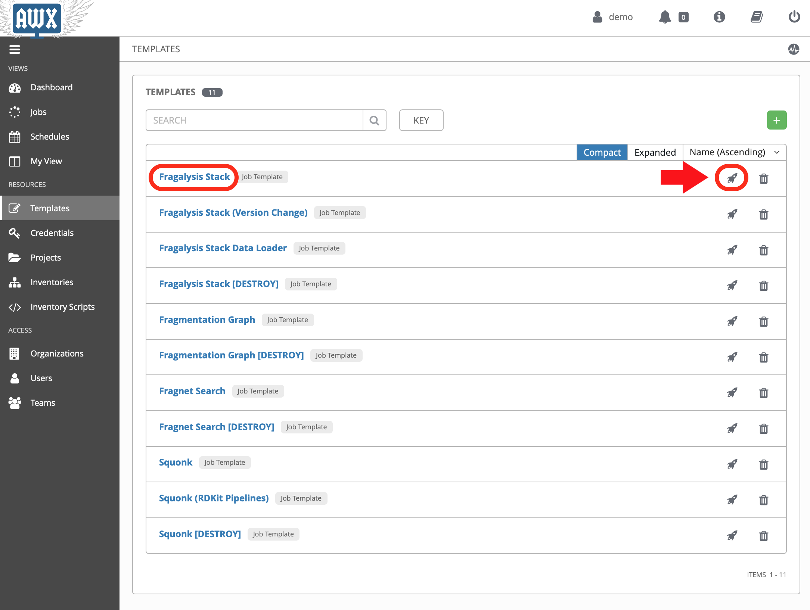
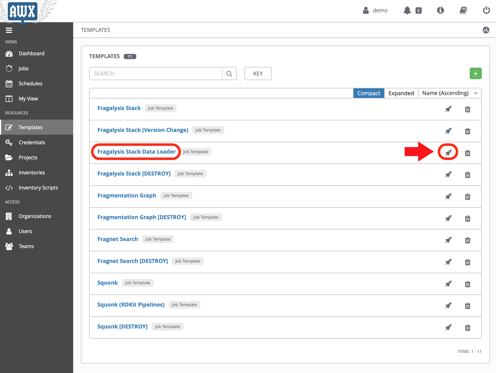

###################
Deploying the Stack
###################

.. note:: Allow **45 minutes** to complete this task.
          5 minutes for the stack and 40 minutes
          for the initial (``ALL_TARGETS``) data load.

With the graph installed we can now start the Fragalysis Stack and its
*Data Loader*.

Deploy Fragalysis by *launching* the **Fragslysis Stack**
template.

As the stack initialisation is a little more deterministic (and short)
the job waits for the stack to become ready before finishing. When this job
finishes you know the stack is "up and running".

You can't use the stack without any target data so you now need to run
the *Data Loader*.

Deploy the loader by *launching* the **Fragslysis Stack Data Loader**
template (see below).

This job will also wait for the loader to complete. As we're
running a typical **ALL_TARGETS** load this will take around 40 minutes.
The job will time-out after an hour.

Once complete you should be able to navigate to the application by navigating
to the URL you used for ``stack_hostname``.
