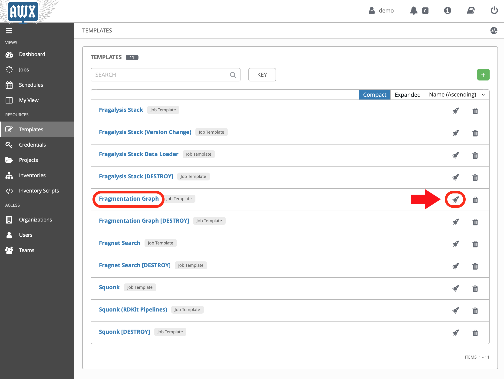

**********************
Basic Graph Deployment
**********************

.. note:: Allow **2 hours** to install all of the applications.

With the AWX server configured we can now run the **Job Templates** that
are responsible for deploying the various applications.

Start by logging into the AWX application server as the demo user ``demo``.
From there you should be able to navigate to the **Templates** screen where
all the templates are presented to you.

The Fragmentation Graph Database
********************************

.. note:: Allow 2 hours to complete this task.

Deploy the Fragmentation graph by *launching* the **Fragmentation Graph**
template.

.. epigraph::

    The jobs have been configured to first present a confirmation dialogue box
    so that you can adjust some key job variables before they run. for example,
    the **Fragmentation Graph** job allows you to provide a path to the
    graph data you want to deploy (using the ``graph_bucket_path`` variable).

Acknowledge the dialogue (clicking **Next**) and then the **Launch** button.

As the graph initialisation can take some time the job does not
(at the time of writing) wait for the graph to initialise. We therefore use the
``kubectl`` command-line to check on the status of the graph before moving on.
Check that the graph namespace exists::

    $ kubectl get namespace/graph
    NAME    STATUS   AGE
    graph   Active   7s

And then *watch* the Graph Pod status until it's ``Running``. The
graph contains an initialisation container used to download the graph
data to the cluster::

    $ kubectl get pod/graph-0 -n graph -w
    NAME      READY   STATUS     RESTARTS   AGE
    graph-0   0/1     Init:0/1   0          14s
    graph-0   0/1     Init:0/1   0          95s
    graph-0   0/1     Init:0/1   0          100s
    graph-0   0/1     PodInitializing   0          108s
    graph-0   1/1     Running           0          114s

Once you see ``Running`` the Pod has started and you can ``ctrl-c`` from the
command.

The graph needs to *import* the downloaded files into a graph database, which
can take a significant length of time, depending on the data that's been
downloaded.

You can *follow* the Graph Pod's logs and wait for the import process to complete.
The graph import typically involved 4 stages that are easily followed from the
logs.

The output here has been truncated because there is a lot of it.
You're waiting to see the word ``Finished.`` issued by the
``cypher-runner.sh`` script::

    $ kubectl logs pod/graph-0 -n graph -f
    [..]
    2020-03-19 14:25:08.527+0000 INFO  ======== Neo4j 3.5.5 ========
    2020-03-19 14:25:08.532+0000 INFO  Starting...
    2020-03-19 14:25:14.865+0000 INFO  Bolt enabled on 0.0.0.0:7687.
    2020-03-19 14:25:16.444+0000 INFO  Started.
    2020-03-19 14:25:17.531+0000 INFO  Remote interface available at http://localhost:7474/
    (cypher-runner.sh) Thu Mar 19 14:26:05 UTC 2020 Setting neo4j password...
    (cypher-runner.sh) Thu Mar 19 14:26:07 UTC 2020 No legacy script.
    (cypher-runner.sh) Thu Mar 19 14:26:07 UTC 2020 Trying /data/cypher-script/cypher-script.once...
    (cypher-runner.sh) Thu Mar 19 14:26:08 UTC 2020 .once script executed.
    (cypher-runner.sh) Thu Mar 19 14:26:08 UTC 2020 No .always script.
    (cypher-runner.sh) Thu Mar 19 14:26:08 UTC 2020 Touching /data/data-loader/cypher-runner.executed...
    (cypher-runner.sh) Thu Mar 19 14:26:08 UTC 2020 Finished.

Once you see that you can ``ctrl-c`` form the *follow* command and continue
with the remaining applications.
