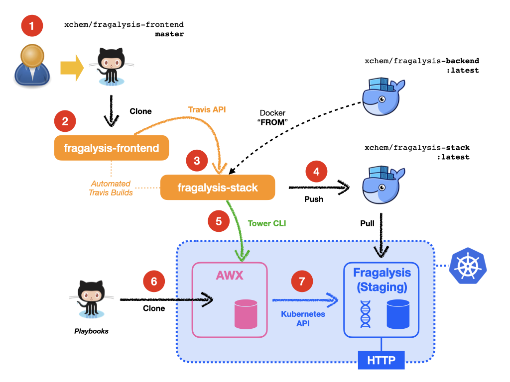

*******************
Continuous Delivery
*******************

.. epigraph::

    Fragalysis Stack continuous integration, delivery and deployment.

Travis
======

The various Fragalysis repositories are registered with `Travis`_, which monitors
each repository, spinning up VMs in response to changes in order to run build
commands located in the project's ``.travis.yml``.

As well as the ``.travis.yml`` instructions, which are visible to all, the
automated build relies on sensitive information that includes Docker Hub
and AWX credentials. This information is provided in the corresponding
repository's Travis management console, where encrypted material is
injected into the build using user-defined `environment variables`_.

Note: -

*   Only commits to **master** and **tag** operations result in the above
    automated sequence. Developers working on their own branches or forks are
    required to build their own images.

Fragalysis Stack
================

Automated deployment of the Fragalysis Stack is achieved through the `Travis`_
CI/CD framework. As changes are committed to the **master** branch of the stack's
GitHub repositories (``xchem/fragalysis-frontend``, ``xchem/fragalysis-backend``
and the ``xchem/fragalysis-stack`` itself) Travis launches a VM and runs the
build instructions located in each project's ``.travis.yml`` file. As an example,
a typical sequence of *actions* that occur in response to a commit to the
**master** branch of ``xchem/fragalysis-frontend`` repository can be seen
illustrated in the following diagram.

Deployment actions (from commits)
---------------------------------

Although Travis launches a build for every change (regardless of branch)
the automated actions shown above and described here only take place when
a repository's **master** branch changes (or is tagged).

1.  A user accepts a *Pull Request* or makes a direct change on the master
    branch to the ``frontend`` code.

2.  A few moments later Travis detects the change, clones the Frontend code
    and executes the commands in its ``.travis.yml``. At the time of writing
    Frontend changes do not result anything being built from within its own
    repository. The frontend code is actually cloned into the Stack when
    it is built.

3.  On success, the Frontend build's instructions **trigger** the Stack's
    Travis build. [#f1]_

4.  The by-product of the Stack build is the ``fragalysis-stack`` container
    image. This is pushed to Docker Hub from the Travis build VM. Here we
    see the ``latest`` tag being used.

5.  At the end of a successful Stack build, and a new ``latest`` image pushed
    to Docker Hub the Frontend ``.travis.yml`` has an instruction to
    **trigger** the launch of a pre-existing **Job** in the AWX server.
    This is achieved through the use of the AWX (Tower) `CLI`_. The Job's
    *name* is injected into the build using a Travis environment variable.

    The Travis build waits for the AWX Job (the Stack's *version-change*
    playbook in this case) to complete. This can take sereval minutes but
    by waiting any failure in deployment is immediately detected.

6.  The AWX playbook (the Stack *version change* playbook in this case)
    executes. The playbook is cloned from its GitHub repository,
    known to AWX, into the AWX *Pod* on the Kubernetes cluster.

7.  Playbook execution, using the Ansible built-in **k8s** module, results in a
    forced redeployment of the Stack's Pods (managed as a multi-Pod `StatefulSet`_).
    The Pods restart one-by-one in an orderly fashion until all the Pods have
    been replaced using a fresh pull of the ``latest`` container images.
    This roll-out strategy prevents any break in service.

Steps 2 to 7 above also take place when commits are made to the
``fragalysis-backend`` repository.

Performance
-----------

The time between a commit to the Frontend repository and the start of the
roll-out of the changes in the cluster is around **8 or 9 minutes**. Each
Stack Pod takes around 3 minutes before it's providing a service endpoint.
A two-Pod StateFulSet will take around **15 minutes** to fully deploy.

Fragalysis Loader
=================

The Loader, like the stack above, is built in the same automated fashion.
It is triggered by changes either to the **master** branch of
the ``xchem/fragalysis-loader`` or via a Travis API trigger from a
``fragalysis-backend`` Travis build process, which takes place whenever the
Backend master code changes.

The Travis-Trigger Utility
==========================

The Travis build **trigger** logic used by the repositories is provided
by a small Python module, cloned into the build process from our
`Trigger Travis`_ GitHub project.

The AWX-Trigger Utility
=======================

The Travis build **trigger** logic used by the repositories is provided
by a small script that drives the Tower CLI, cloned into the build process
from our `Trigger AWX`_ GitHub project.

.. rubric:: Footnotes

.. [#f1] The build knows that the stack needs to be built because this
         dependency is *hard-coded* into the Frontend's ``.travis.yml``.

.. _cli: https://pypi.org/project/ansible-tower-cli/
.. _environment variables: https://docs.travis-ci.com/user/environment-variables/
.. _statefulset: https://kubernetes.io/docs/concepts/workloads/controllers/statefulset/
.. _travis: https://travis-ci.com
.. _trigger awx: https://github.com/InformaticsMatters/trigger-awx
.. _trigger travis: https://github.com/InformaticsMatters/trigger-travis
