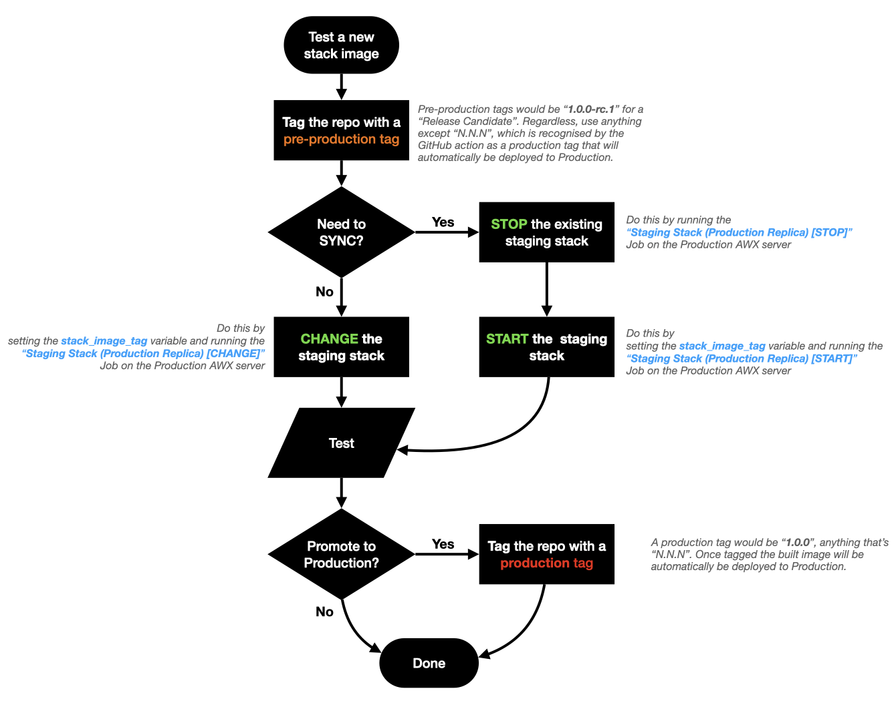

###################
Pre-release testing
###################

Prior to deploying a Fragalysis Stack build to the production Kubernetes
namespace you are first required to deploy the proposed build to the staging
namespace.

This will give you an opportunity to test the application in
a production-like deployment (using the media and database content from
the production namespace).

**********************************
Deploying to pre-release (staging)
**********************************

Detailed steps, and flowchart (below).

You will need access to: -

-   The ``fragalysis-stack`` GitHub repository
-   The production cluster AWX server

1. Tag
======

Trigger a Fragalysis Stack build by tagging the ``fragalysis-stack``
repository with a **pre-release tag**. Use `Semantic Versioning`_ where
a pre-release tag should be denoted by appending a hyphen and a series of
dot separated identifiers immediately following the patch version.
Examples: ``2.6.6-alpha.1``, ``2.6.6-beta.1`` ``2.6.6-rc.1``

..  note::
    You will need to use the tag you have chosen in the START/CHANGE AWX
    Job Template you decide to run next...

2. Sync and/or deploy
=====================

Decide if you need to re-synchronise the staging stack with the
current production data.

*   **If you need to synchronise**, you need to shutdown the existing stack
    and restart it (synchronising database and media files) using the
    ``STOP`` and ``START`` playbooks shown in the flowchart below.
    This will take approximately 10 minutes.

*   If you do not need to synchronise you can simply deploy the tagged
    stack image over the existing deployment using ``CHANGE`` AWX Job
    Template shown in the flowchart below

..  warning::
    Whether you synchronise or not you *MUST* provide the tag of the build
    that you want to deploy in either the ``START`` or ``CHANGE`` template
    (by using it for the ``stack_image_tag`` variable in the corresponding
    Job Template's ``EXTRA VARIABLES`` block)

3. Test
=======

With the stack deployed you can now execute any testing you see fit.

Flowchart reminder
==================

***********************
Promoting to production
***********************

Once you are happy with the build you can promote the image to production
by re-tagging the fragalysis stack repository (using the same commit) using
a non-pre-release tag, e.g. ``2.6.6``, any tag that contains Major, Minor
and Patch values only.

.. _semantic versioning: https://semver.org
