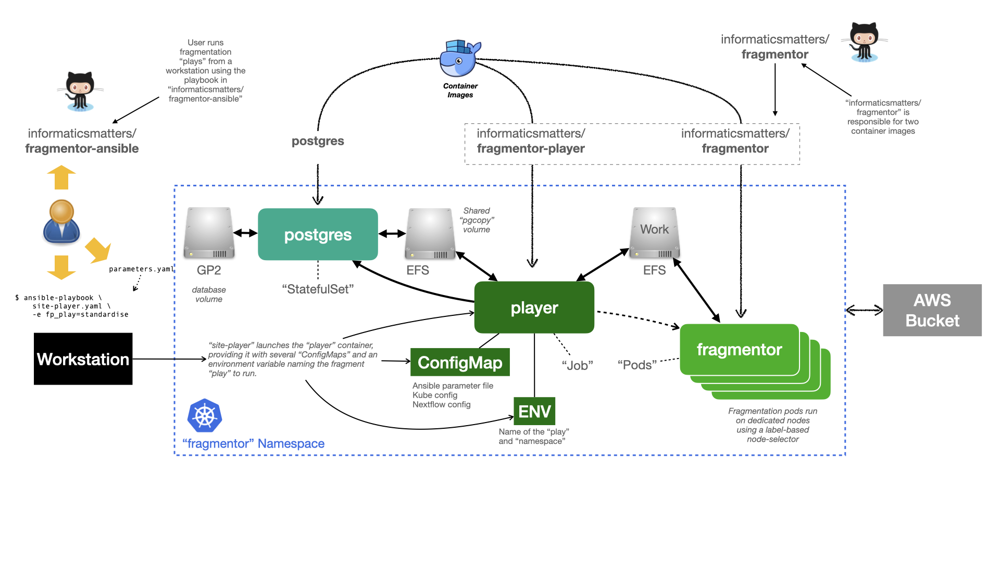

#######################
Fragmentation Processes
#######################

..  epigraph::

    The fragmentation process runs in Kubernetes and is able to process
    vendor molecule data into a form that can be used in our graph database
    and fragalysis.

************
Architecture
************

Fragmentation is implemented and described in our `fragmentor`_ repository.

Converting vendor data into a form suitable for a graph database requires the
use of two container images (a *player* and a *fragmentor*). these images are
built from the `fragmentor`_ repository's code. The process also
relies on a PostgreSQL database.

The process is divided into a number of "plays" that *standardise* the vendor
data, *fragment* it (into a database) and then *extract* the fragments to form
a graph.

The whole process is managed from a workstation using the playbook provided
in the `fragmentor-ansible`_ repository.

The actual "plays" are orchestrated by the *player* container launched from
the user's workstation. It launches a number of *fragmentor* containers in
order to distribute the workload amongst a number of parallel processes that
share a common volume for data processing.

AWS S3 is used as a source of vendor data and where the final results are
written as illustrated in the following diagram: -

..  note::
    The role of this section of the documentation is not to explain the actual
    process but to explain how to execute it, within a Kubernetes cluster.

************
Installation
************

Our `fragmentor-ansible`_ repository contains a detailed description of
the installation and execution of the fragmentor and it describes what you'll
need to do to process a small set of molecules (up to a few thousand).
Refer to it for up-to-date instructions but you will need: -

1.  A kubernetes **Namespace**
2.  A **ReadWriteMany** storage class (like NFS or EFS)
3.  Nodes with our **Node Labels** for the fragmentation Pods
4.  A **postgres database** (and user)
5.  An AWS **Bucket**
6.  Plenty of spare cores and memory

Follow the **Kubernetes namespace setup** section of the repo's README
for a fuller description of how to setup the cluster. The section provides
an example set of parameters that you can use.

Support for private-registry images
===================================

If you need to source database images from a private repository and need
to provide an **ImagePullSecret** for them you can provide those as
additional parameters::

    pg_image_registry: my-registry
    pg_image_name: postgres
    pg_image_version: '12.2'
    all_image_preset_pullsecret_name: my-secret

..  warning::
    If you're expect to process a large number of molecules you'll need to
    consult with us to understand what preparation you'll need before you
    embark on any fragmentation as using the basic setup described will not
    be suitable.

******************
Running the player
******************

With the cluster setup (and database installed in the **Namespace**) you
should be able to run the fragmentor plays [#f1]_. This is
documented in the `fragmentor-ansible`_ repository README's
**Running a play** section.

This essentially requires the one-time preparation of the database
(handled by the player) and then running the fragmentation process,
which entails the use of the following plays: -

-   **standardise**
-   **fragment**
-   **inchi**
-   **extract**

Refer to the `fragmentor`_ repository for further details of the
S3 and data requirements and a description of the basic process.

Support for private-registry images
===================================

If you need to source the player and fragmentation images from a private
repository and need to provide an **ImagePullSecret** for them you can provide
those as additional parameters in the player's parameter file::

    # Details of the 'player' image
    fp_image_registry: my-registry
    fp_image_name: informaticsmatters/fragmentor-player
    fp_image_tag: '1.0.0'
    # Details of the 'fragmentor' image
    nextflow_container_registry: my-registry
    nextflow_container_name: informaticsmatters/fragmentor
    nextflow_container_tag: sdf-05
    # The common pull-secret
    all_image_preset_pullsecret_name: my-secret

.. rubric:: Footnotes

.. [#f1] You will need molecule data in a supported format stored in your
         bucket

.. _fragmentor: https://github.com/InformaticsMatters/fragmentor
.. _fragmentor-ansible: https://github.com/InformaticsMatters/fragmentor-ansible
