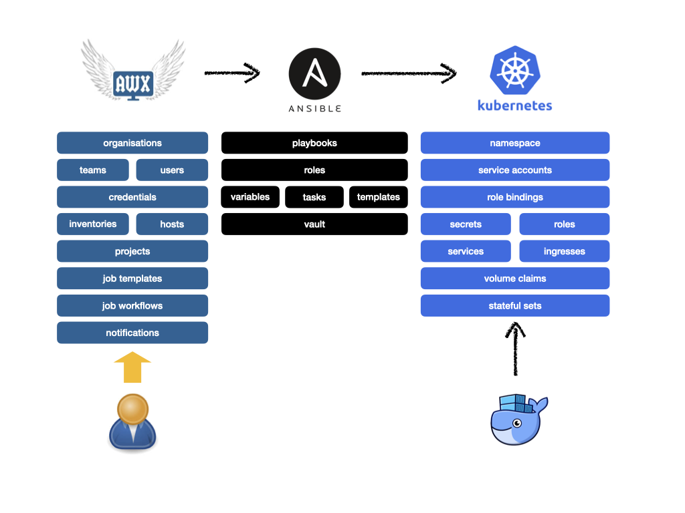
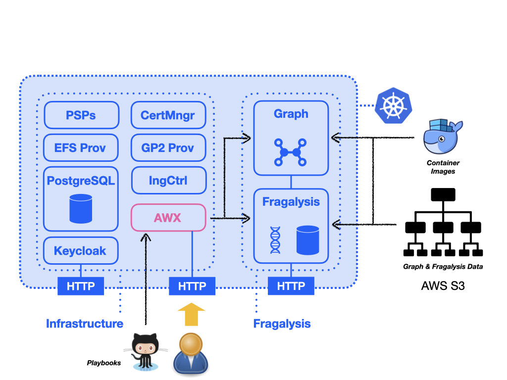

################
AWX Fundamentals
################

.. epigraph::

    A brief overview of AWX and our use of it.

AWX is a task engine built on top of Ansible that is able to simplify, manage
monitor application deployments through the use of Ansible playbooks present
in repositories (GitLab, GitHub etc.). We're not going to go into detail
about how the AWX server we use is fully configured, instead we're just going
to explore some key aspects that are essential to deploying the Fragalysis
Stack.

AWX provides *Job* definitions that allow the execution of Ansible *Playbooks*
located in Git repositories. AWX executes these plays on *Hosts* defined
in *Inventories* within AWX.

AWX is useful layer on top of raw Ansible because it provides: -

1.  A centrally administered authoritative catalogue of *Jobs* (plays)
2.  Controlled access to Jobs through the use of *Organisations*,
    *Teams* and *Users*. Jobs can be setup so they're only available to permitted
    Users, Teams or Organisations, with varying levels of *Access*.
    Full access to a Job can be granted with *Admin* permissions or limited to
    *Execution-only* rights for named Users (or Teams or Organisations).
3.  Job execution *History*
4.  Job failure *Notifications* (e.g. via email)

AWX is a task engine we use to execute Ansible playbooks that manage
Kubernetes objects.

Objects
=======

To run a playbook in AWX you typically need to create the following minimum
set of objects: -

*   An **Organisation**
*   A **Team**
*   A **User**
*   An **Inventory** and **Hosts**, often something simple like ``localhost``
*   **Credentials**, like Kubernetes cluster credentials
*   A **Project**, which is a reference to a GitHib project containing the play
*   A **Job Template**, that joins the inventory, credentials and project
    together with the opportunity to over-ride default variables in the
    corresponding play

****************
AWX in Operation
****************

The AWX server is deployed with our Kubernetes Infrastructure, along with
a Keycloak instance and PostgrSQL database. It provides a web interface
that allows Jos to be executed that deploy Fragalysis application components
(like the Graph database and Fragalysis itself).
Deployment of applications often depends on: -

*   Access to **playbooks** resident in external Git repositories
*   Access to publicly available **container images**
*   Configuration **data** (typically graph and Fragalysis data) held
    externally (e.g. on AWS S3)

Because the Production and Development clusters serve two very different
purposes, and one is much more sensitive than the other, separate AWX servers
exist - one in the Production cluster and one in the Development cluster.

Users may not have access to both and Developers are unlikely to have access
to the Production AWX server.
