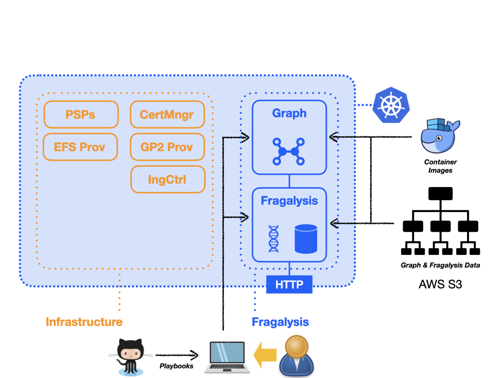

#############################################
Installation - Basic (On-Prem Infrastructure)
#############################################

.. epigraph::

    Ideally you deploy our validated infrastructure following the
    :doc:`../basic/index` approach but, if you cannot deploy this way
    this section describes the installation for on-premises or restricted clusters.
    i.e. you may not be able to install AWX (which pulls images form docker hub)
    or you security group rules prevent you from installing our EFS provisioner.

A *basic* cluster contains only the essential infrastructure components
to support the Fragalysis Stack and includes the deployment of a single,
production-grade (versioned), Stack.

The following schematic illustrates what we'll be installing. the important
aspect of an *on-premises* installation is that you are responsible for the
infrastructure, which consists of security policies, storage provisioners,
certificate management and an ingress controller: -

From this point we assume you have a viable cluster and suitable
infrastructure. That means that you have the following: -

*   An NGINX ingress controller and associated Network Load balancer
*   A RWX storage class (AWS EFS in our case)
*   a RWO storage class (AWS GP2 in our case)
*   Pod Security Policies
*   Certificate management

What follows are the steps required to deploy a single
Fragalysis Stack and associated Graph database to that cluster: -

..  toctree::
    :maxdepth: 1

    ../control-machine
    graph-deployment
    stack-deployment
    example-variables
