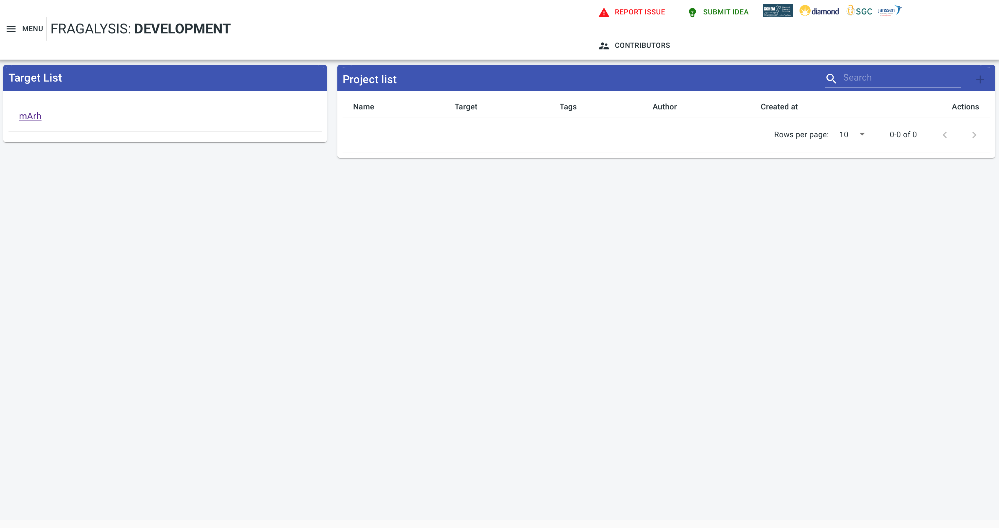
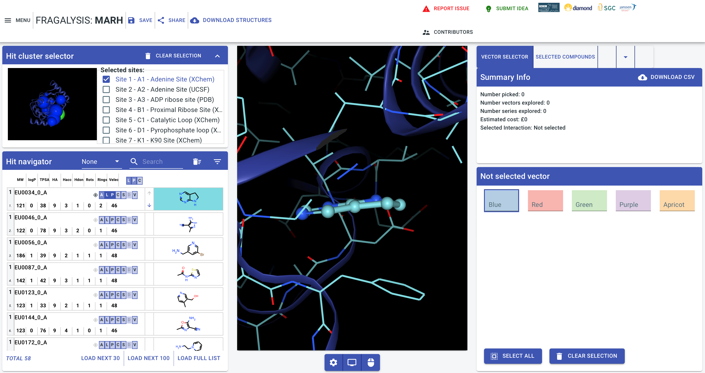
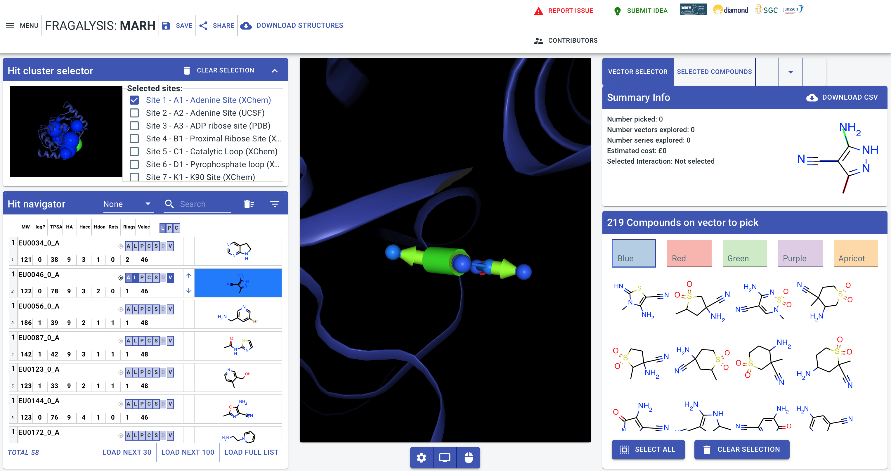

################
mArh Screenshots
################

Target List
===========

If you've loaded data for the **mArh** target using the example data origin
**2020-09-15T16** then, when you navigate to the stack instance you should be
presented with **mArh** in the target list (there may be others depending on
what else you may have loaded) as shown below: -

Hit Navigator
=============

If you click on the **mArh** target you should see the **Hit** screen,
with a cluster selector and navigator, ash shown below: -

To test the graph database connection de-select the **EU0034_0_A** molecule
by clicking its dark-blue "L" (*ligand*) and "P" (*sidechains*) boxes and
instead click "L" and "P" for the 2nd molecule (**EU0046_0_A**). Now also
click the "V" (*vectors*) button.

With this done, if your database connection is working, you should should see
arrows and cylinders attached to the molecule, as shown below:- [#f1]_

Alternative Molecules
=====================

Click the cylinder: -

And you should then see a number of alternative molecules presented to you,
extracted form the fragment database, on the right-hand side of the application
window: -

If that works then your stack deployment has been successful!

.. rubric:: Footnotes

.. [#f1] Initial queries for the graph database often take a few seconds
         so you might need to wait a wile for the first query to complete.
