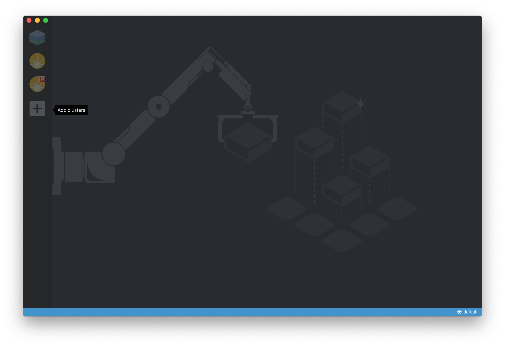
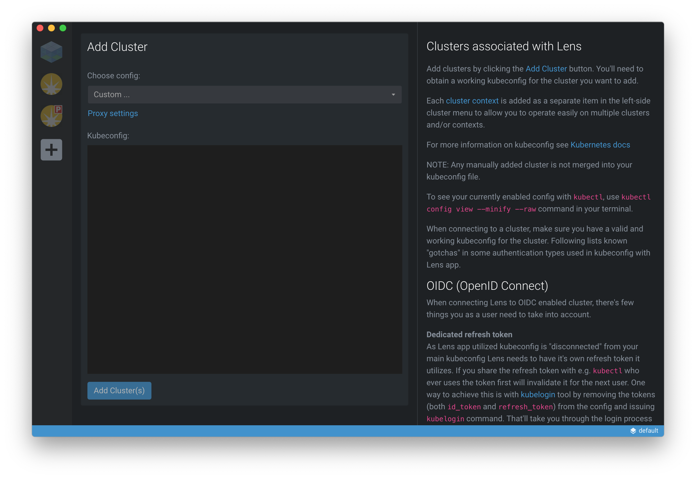
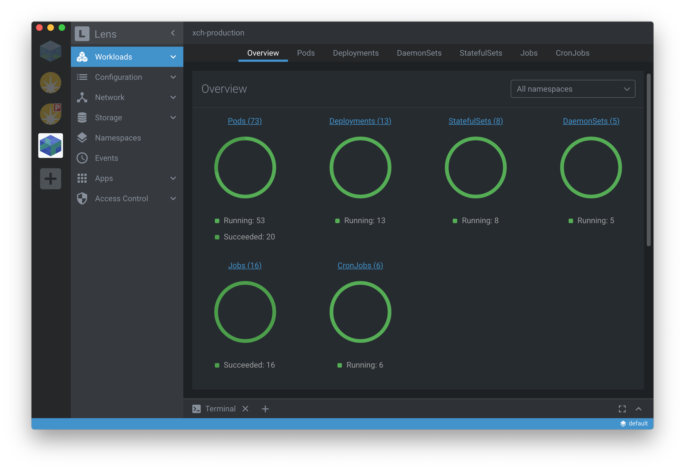

******************
Preparing for lens
******************

You will need to install `lens`_, a neat community-driven IDE for Kubernetes,
and then provide your kubernetes configuration file.

Installing lens
===============

Refer to the `lens`_ website for installation instructions. You should install
version 3.4 or better.

Provide your KUBECONFIG
=======================

The first time you start lens you will need to provide a cluster configuration.

Click the **Add clusters** icon in the application side-bar...

Then select **Custom ...** from the **Choose config:** drop-down, and then paste
the content of the kubernetes configuration file into the **Kubeconfig:**
panel and then finish by clicking **Add Cluster(s)**...

If successful you should be presented with an overview of the cluster
workloads (as shown below).

Now that you're connected to the cluster through Lens you can quickly navigate
to the **Workloads** (which includes Pods, Deployments, StatefulSets and Jobs),
**Configuration** (for ConfigMaps, Secrets etc.), **Network** (for Services
and Ingresses), **Storage** (so see PersistentVolumes and
PersistentVolumeClaims) and **Namespaces** (to see all the namespaces).

Adding a cluster icon
---------------------

If youwant to add a distinctive icon for the cluster yoy can. Simply
right-click the exiting cluster icon in the side-bar and select **Settings**.
Use the **Browse for new icon...** to select an icon of your choice.

..  epigraph::

    Two icons can be found in this repository that can be used for the
    Development and Production clusters (whcih can be found in the project's
    ``lens/icons`` directory).

.. _lens: https://k8slens.dev
