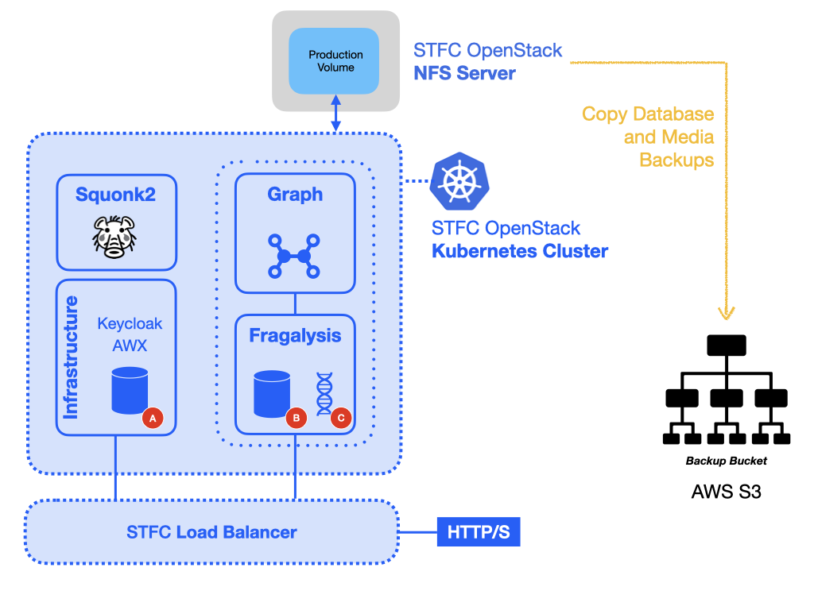

########################
Preparing for relocation
########################

.. warning::
    Before going further it would be wise to suspend any user activity on the
    production stack - to prevent the Fragalysis data from changing while the
    move to the new cluster tales place. You could, for example, scale-down the
    Fragalysis and Keycloak **Pods** (controlled by an associated Kubernetes
    **StatefulSet**).

.. note::
    You cannot be using ``kuebectl`` for port forward or be using a kubectl-like
    application (like ``lens``) during this process.

***************
Backup location
***************

The keycloak database is backed up using the STFC cluster's NFS server (``192.168.253.39``).
This server is used by the developer and production clusters and contains dedicated
volumes for dynamic allocation of NFS volumes for both clusters, one volume for
production stack database, and another for production media replication.

All volumes served by NFS for the Development and Production clusters are mounted in
the server's ``/nfs`` directory.

Here, you are expected to have `aws cli`_ installed on the NFS server,
configured with access to a suitable AWS S3 bucket to copy the files to,
and so you will need to set the standard AWS environment variables:::

    export AWS_ACCESS_KEY_ID=00000000000000
    export AWS_SECRET_ACCESS_KEY=000000000000000000000
    export AWS_DEFAULT_REGION=eu-central-1

With credentials for the Informatics Matters bucket you should be able to inspect
the  ``im-fragalysis`` bucket::

    aws s3 ls s3://im-fragalysis

***********
The backups
***********

Keycloak database (A)
=====================

The keycloak database is regularly backed, at 7 minutes past every hour.
The backup files are written to the ``pg-bu`` NFS **PVC** in the ``im-infra`` **Namespace**.
At the time of writing the volume used is ``pvc-5fad6224-8ad9-40b0-a3eb-aa6c9c845d49``,
and you should find this on the NFS server in the directory::

    /nfs/kubernetes-prod/im-infra-pg-bu-pvc-5fad6224-8ad9-40b0-a3eb-aa6c9c845d49

A small number of **hourly** backups are maintained and you should find these in the
``hourly`` subdirectory using a naming convention like::

    backup-[ISO8601 date and time]-dumpall.sql.gz

These files are a **dump-all** backup of the entire keycloak PostgreSQL database used
by Keycloak. Select one and, using the **AWS CLI** replicate it to an S3 bucket. The
following places the backup file ``hourly/backup-2023-10-16T12:07:01Z-dumpall.sql.gz``
into the bucket as the object ``production-keycloak-db/backup-2023-10-16T12:07:01Z-dumpall.sql.gz``::

    aws s3 cp \
        hourly/backup-2023-10-16T12\:07\:01Z-dumpall.sql.gz \
        s3://im-fragalysis/production-keycloak-db/

Fragalysis django database (B)
==============================

Like the Keycloak PostgreSQL database the production stack Django database is also
regularly backed up. You should find these hourly backups on the the NFS server
directory::

    /nfs/kubernetes-prod/production-stack-database-backup-pvc-d2affd17-5291-4c19-b4e3-a6253f35a737

Pick one and copy this to your chosen S3 bucket::

    aws s3 cp \
        hourly/backup-2023-10-16T12\:51\:01Z-dumpall.sql.gz \
        s3://im-fragalysis/production-stack-db/

Fragalysis media (C)
====================

Like the PostgreSQL databases the production stack **media** directory is also
regularly backed up. The production stack's ``/code/media`` directory is synchronized
every morning (at 4am) to the following NFS server directory::

    /nfs/kubernetes-media-replica

To copy the production stack's backup media directory to S3 you can run the
following command::

    aws s3 cp \
        /nfs/kubernetes-media-replica \
        s3://im-fragalysis/production-stack-media/ \
        --recursive

The current media directory is large (approximately 149Gi) and copying
from the NFS server to an AWS S3 bucket will take a long time. Expect the copy to
take at least 30 minutes or so.

****************************
Pod (container) environments
****************************

While the original **Pods** are still running you should also collect and record
the full set of environment variables just in case you need to refer to them
after access to the original **Pods** is lost.

Collect the output of the following commands for the stack::

    kubectl exec -it database-0 -n production-stack -- env
    kubectl exec -it stack-0 -n production-stack -- env

And these for keycloak::

    kubectl exec -it database-0 -n im-infra -- env
    kubectl exec -it keycloak-0 -n im-infra -- env

.. _aws cli: https://docs.aws.amazon.com/cli/latest/userguide/getting-started-install.html
