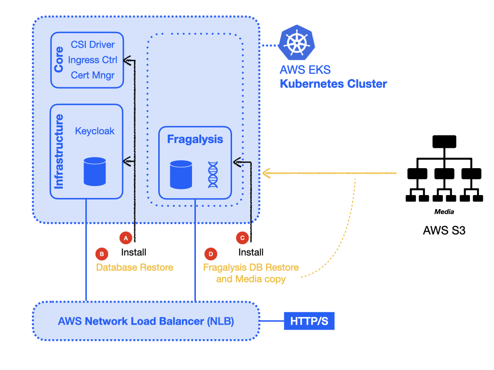

#########################
Installation and recovery
#########################

*************
Prerequisites
*************

For a Stack **without access to a Graph database** you will need the following: -

*   A ``KUBECONFIG`` file (providing admin access to each cluster)
*   A compatible kubectl client (i.e. kubectl 1.23)
*   An ACME/let's encrypt account (for SSL certificates) (`letsencrypt`_)
*   `Poetry`_

.. note::
    You could create a cluster with one worker of 16 cores and 32Gi RAM, or two
    worker nodes, each providing 8 cores and 16Gi RAM. On AWS having multiple nodes
    will probably be no real advantage. AWS EKS is extremely robust and resilient
    and the cost of will ultimately depend on the total cores and RAM you're using.

*************************
Installation and recovery
*************************

Creating an EKS cluster
=======================

.. warning::
    To avoid the following steps for disturbing any local **KUBECONFIG** file you may
    have defined you should run ``unset KUBECONFIG`` before proceeding.

Create a cluster in AWS using `eksctl`_. The best way to do this is by defining
your cluster in a ``cluster.yaml`` file. The following example, which creates
a Kubernetes 1.23 cluster in  London (``eu-west-2``), should be sufficient
for our needs::

    ---
    apiVersion: eksctl.io/v1alpha5
    kind: ClusterConfig

    metadata:
      name: fragalysis-production
      region: eu-west-2
      version: '1.23'

    availabilityZones:
    - eu-west-2a
    - eu-west-2b
    - eu-west-2c

    managedNodeGroups:
    - name: mng-1
      # The 2xlarge is an 8 core 32Gi instance
      instanceType: m5.2xlarge
      minSize: 1
      maxSize: 1
      desiredCapacity: 1
      volumeSize: 80
      volumeType: gp2
      labels:
        informaticsmatters.com/purpose-core: 'yes'
        informaticsmatters.com/purpose-worker: 'yes'
        informaticsmatters.com/purpose-application: 'yes'

This file can be found in the `dls-fragalysis-stack-kubernetes`_ repository
(as ``eks-relocation/cluster.yaml``).

.. note::
    The schema for the ``cluster.yaml`` file can be found on the `eksctl schema`_ page.

    It is vitally important that the cluster version you have chosen is compatible
    with the kubernetes cluster we are relocating. At the time of writing this
    is **1.23**.

With a cluster configuration available, create it with the following command::

    eksctl create cluster -f cluster.yaml

The cluster should be ready in about 15 minutes. Once it is ready you will find
that cluster credentials were added in ``~/.kube/config``.

If you need to you can list and select a kubernetes context using the context ``NAME``
using ``kubectl``::

    kubectl config get-contexts
    kubectl config set current-context MY-CONTEXT

You'll now be able to inspect your new cluster with ``kubectl``, where you should
discover one node::

    kubectl get nodes

Core components
===============

Before installing Keycloak and the Fragalysis Stack you will need to configure and
install some core components, namely: -

*   Configure Amazon EBS CSI driver to create a GP2 **StorageClass**
*   Install an NGINX **Ingress Controller**
*   Install the SSL **Certificate Manager**
*   Configure the cluster's load balancer
*   Setup domain routing
*   Create a cluster admin **ServiceAccount**

But first, if you need to, set the ``KUBECONFIG`` environment variable to point to
your ``KUBECONFIG`` file. This will be used by the ``kubectl`` client to access your
cluster and our playbooks::

    export KUBECONFIG=/path/to/your/kubeconfig

EBS CSI driver
--------------

From EKS 1.23 a Container Storage Interface (CSI) driver is needed in order to get
your **PersistentVolumeClaims** served by a **PersistentVolume** as you are used to
from earlier EKS versions (see `aws-ebs-csi-driver`_ for more information).

Firstly, setup the driver permissions using ``kubectl`` to create a secret from your
AWS credentials::

    kubectl create secret generic aws-secret \
        --namespace kube-system \
        --from-literal "key_id=${AWS_ACCESS_KEY_ID}" \
        --from-literal "access_key=${AWS_SECRET_ACCESS_KEY}"

Then, use the ``kubectl`` **kustomize** feature to deploy the driver::

    kubectl apply -k "github.com/kubernetes-sigs/aws-ebs-csi-driver/deploy/kubernetes/overlays/stable/?ref=release-1.23"

Ingress Controller
------------------

Use ``kubectl`` to install a recent NGINX Ingress Controller, used as an in-cluster
*load balancer* and required by the various application **Ingress** definitions::

    repo=https://raw.githubusercontent.com/kubernetes/ingress-nginx
    path=deploy/static/provider/cloud/deploy.yaml
    version=controller-v1.9.1

    kubectl apply -f ${repo}/${version}/${path}

.. note::
    You can check the condition of the installation (which may take a few minutes)
    by inspecting the **Pods** in the ``ingress-nginx`` namespace::

        kubectl get pods --namespace ingress-nginx

Certificate Manager
-------------------

Use ``kubectl`` to install a recent Certificate Manager, used to automatically
provision SSL certificates for the kubernetes **Ingress** definitions::

    repo=https://github.com/cert-manager/cert-manager/releases/download
    path=cert-manager.yaml
    version=v1.13.1

    kubectl apply -f ${repo}/${version}/${path}

.. note::
    You can check the condition of the installation (which may take a few minutes)
    by inspecting the **Pods** in the ``cert-manager`` namespace::

        kubectl get pods --namespace cert-manager

You will also need to provide a **ClusterIssuer** definition that allows the application
**Ingress** definitions to trigger the automatic creation of SSL certificates. We use
``ACME`` (Let's encrypt) and suggest you do to. For this you will need to have registered
and have the email address you used to register.

Armed with your let's encrypt account email address create a
file called ``cluster-issuer.yaml`` with the following content
(replacing ``<EMAIL-ADDRESS>`` by one appropriate for you)::

    ---
    kind: ClusterIssuer
    apiVersion: cert-manager.io/v1
    metadata:
      name: letsencrypt-nginx-production
    spec:
      acme:
        email: <EMAIL-ADDRESS>
        privateKeySecretRef:
          name: letsencrypt-nginx-production
        server: https://acme-v02.api.letsencrypt.org/directory
        solvers:
        - http01:
            ingress:
              ingressClassName: nginx

You will find a template file in the ``eks-relocation`` directory that you can edit.
The name of the **ClusterIssuer** is important, and it is expected to be
called ``letsencrypt-nginx-production``.

Once you have a valid **ClusterIssuer** you can then apply the definition to
your cluster::

    kubectl apply -f cluster-issuer.yaml

Configure the cluster's load balancer
-------------------------------------

Check on what is probably an "inactive" *Classic* Load Balancer that will have been
created in your AWS region and then **Migrate** it by clicking the
**Launch NLB migration wizard** button. From the new page simply click the **Create**
button to create a **Network Load Balancer** (**NLB**), and close the final window upon
success.

.. note::
    If you return to the Load Balancers page you will probably find the LB
    **State** to be *Provisioning*. This may take a few minutes so refresh the page
    after a minute or two. When it is *Active* make sure your EKS cluster EC2 instances
    are in the **Listeners Target Group** for the pre-assigned Protocols.

Setup domain routing
--------------------

With the cluster prepared now is the time to arrange for any applicable domain names
to be re-routed to the assigned DNS name of the **NLB** created for your EKS cluster.

For us we'll need to make sure the following domains are routed to the NLB via a suitable
*A record*::

    fragalysis.diamond.ac.uk
    *.xchem.diamond.ac.uk (for the keycloak server)

The DNS name for the **NLB** will be of the form ``000000-000000.elb.eu-west-2.amazonaws.com``,
and this should be used as an **A record** (or **A record alias**) for the
appropriate domains.

Do this as soon as you can as DNS changes may take a few minutes but they can
also take several hours.

A cluster service account
-------------------------

To allow users other than the cluster creator to access the cluster you will need
to add a **ServiceAccount** that will allow you to create a token that can be used
in the ``KUBECONFIG`` file.

Create the required **Namespace**, **ServiceAccount** and **ClusterRoleBinding** with
the following command, run from the ``eks-relocation`` directory::

    kubectl create -f im-eks-admin

Now, add the service account and its token as a new user definition
to the ``KUBECONFIG`` file. You can refer to the documentation for
`Adding a Service Account`_::

    TOKEN=$(kubectl get secrets -n im-eks-admin \
        -o jsonpath="{.items[?(@.metadata.annotations['kubernetes\.io/service-account\.name']=='im-eks-admin')].data.token}"\
        |base64 --decode)
    kubectl config set-credentials im-eks-admin --token=${TOKEN}

Now you can set the new user for future kubectl commands::

    kubectl config set-context --current --user=im-eks-admin

Infrastructure components
=========================

With the base components installed you can now install the infrastructure.

Because we are recovering the infrastructure database from elsewhere the
creation of the infrastructure will take several steps: -

-  Create the infrastructure database server
-  Restore the infrastructure databases
-  Create the keycloak instance

For our application **Pods** we will need to label the worker nodes in the cluster.

If you've used the example ``cluster.yaml`` file you can skip these labelling commands
as the ``eksctl`` utility will ensure that any nodes it creates will have the
appropriate labels applied.

To label nodes we apply them to each node.

Run the following for each node in your cluster::

    node=<NODE-NAME>
    kubectl label nodes ${node} informaticsmatters.com/purpose-core=yes
    kubectl label nodes ${node} informaticsmatters.com/purpose-worker=yes
    kubectl label nodes ${node} informaticsmatters.com/purpose-application=yes

From this point we rely on Ansible playbooks that are provided in the
the Informatics Matters `ansible-infrastructure`_ repository, so you will need to clone
the recommended version now::

    git clone https://github.com/InformaticsMatters/ansible-infrastructure.git
    cd ansible-infrastructure
    git checkout 2023.4

All the playbooks are controlled by variables that we typically define in a
YAML *parameter* file. A number of parameter files exist in the root of the
repository, encrypted using `ansible-vault`_. You will need to create your own
parameter file and decide whether you want to encrypt it. You might want to
if the parameters contain sensitive information (but encryption is not covered here).

.. note::
    Use ``parameters.template`` in the `ansible-infrastructure`_ repository
    in as a template for your own parameter file.

Infrastructure database server
------------------------------

For this exercise the following, written to ``parameter.yaml`` (ignored by the
project gitignore file), should suffice. Replace ``<NEW-ADMIN-PASSWORD>``,
``<HOSTNAME>``, ``<KEYCLOAK-DB-PASSWORD>``, and ``<KEYCLOAK-ADMIN-PASSWORD>``
as appropriate::

    ---
    cm_state: absent
    ic_state: absent
    efs_state: absent
    cinder_state: absent
    ax_state: absent

    pg_version: 12.3-alpine
    pg_vol_storageclass: gp2
    pg_vol_size_g: 18
    pg_create_users_and_databases: no
    pg_user: postgres
    pg_user_password: <NEW-ADMIN-PASSWORD>
    pg_database: postgres
    pg_bu_state: absent

    kc_state: absent
    kc_hostname: <HOSTNAME>
    kc_user_password: <KEYCLOAK-DB-PASSWORD>
    kc_admin_password: <KEYCLOAK-ADMIN-PASSWORD>

.. warning::
    As we're replicating an existing installation be sure to use a different
    admin user and password (``NEW-ADMIN-PASSWORD``).

With parameters set we should now be able to deploy an "empty" infrastructure
database server::

    ansible-playbook site.yaml -e @parameters.yaml

Restore the database
--------------------

With a new "empty" infrastructure installed we can now restore the database from
a backup of the original. You can use the **AWS CLI** and ``kubectl`` to copy
the backup from S3 to the PostgreSQL Pod's database volume, and then restore the data
using ``psql`` from within the Database **Pod**.

Copy the backup from your AWS S3 bucket onto your control machine
and then write it into the database **Pod**::

    aws s3 cp \
        s3://im-fragalysis/production-keycloak-db/backup-2023-10-16T12\:07\:01Z-dumpall.sql.gz \
        ./dumpall.sql.gz

    kubectl cp ./dumpall.sql.gz \
        database-0:/tmp/dumpall.sql.gz \
        -n im-infra

You can now shell into the **Pod**, and decompress and load the backup::

    kubectl exec -it database-0 -n im-infra -- bash
    cd /tmp
    gzip -d dumpall.sql.gz
    psql -q -U postgres -f dumpall.sql template1

With the database restored use the Database **StatefulSet** to scale down the **Pod**
(to remove it) and then scale it up again (to restart it), essentially rebooting the
database server::

    kubectl scale statefulset database --replicas=0 -n im-infra
    kubectl scale statefulset database --replicas=1 -n im-infra

Installing Keycloak
-------------------

With the original database restored we can install Keycloak by adjusting
our parameter file and re-running the same infrastructure playbook.

Ensure the following parameter values are now set in your parameter file::

    kc_state: present
    kc_version: 10.0.2

And then re-run the infrastructure playbook::

    ansible-playbook site.yaml -e @parameters.yaml

Verify that you are able to reach the Keycloak server at the hostname you defined
by appending ``/auth``.

Production Stack
================

From this point we rely on Ansible playbooks that are provided in the
the Informatics Matters `dls-fragalysis-stack-kubernetes`_ repository,
so you will need to clone the recommended version now::

    git clone https://github.com/InformaticsMatters/dls-fragalysis-stack-kubernetes.git
    cd dls-fragalysis-stack-kubernetes
    git checkout 2023.13

Deploy the database
-------------------

We need a new set of parameters to replicate the database installation.

You will find a ``parameters.template.yaml`` in the ``eks-relocation`` directory.
You can use this to create a ``parameters.yaml`` file in the project root
(which is protected by the ``.gitignore``).

Create a ``parameters.yaml`` and populate it with the following::

    ---
    database_image_tag: '12.2'
    database_vol_size_g: 18
    database_vol_storageclass: gp2
    database_root_user: postgres
    database_root_password: anything-you-like
    database_create_users_and_databases: no
    database_bu_state: present
    database_bu_vol_storageclass: gp2
    database_bu_vol_size_g: 18

    stack_namespace: production-stack
    stack_is_for_developer: no
    stack_skip_deploy: yes
    stack_discourse_host: ''

    install_prerequisite_python_modules: no

The root user password can be any value you like, the database has no public facing
surface. Only those with access to the cluster will be able to access it.

And then run the stack playbook. Because we are including sensitive material
that's encrypted in this repository we'll need to provide a vault password.
(more on this later)::

    ansible-playbook site-fragalysis-stack.yaml \
        -e @parameters.yaml \
        --ask-vault-password

Restore the database
--------------------

Just as we did with the infrastructure database we restore the database from
a backup of the original production stack.

Copy the backup from your AWS S3 bucket onto your control machine
and then write it into the database **Pod**::

    aws s3 cp \
        s3://im-fragalysis/production-stack-db/backup-2023-10-16T12\:51\:01Z-dumpall.sql.gz \
        ./dumpall.sql.gz

    kubectl cp ./dumpall.sql.gz \
        database-0:/tmp/dumpall.sql.gz \
        -n production-stack

This is likely to be a large file, so it may take a while to copy.

Once done you can shell into the **Pod**, and decompress and load the backup::

    kubectl exec -it database-0 -n production-stack -- bash
    cd /tmp
    gzip -d dumpall.sql.gz
    psql -q -U postgres -f dumpall.sql template1

With the database restored use the Database **StatefulSet** to scale down the **Pod**
(to remove it) and then scale it up again (to restart it), essentially rebooting the
database server::

    kubectl scale statefulset database --replicas=0 -n production-stack
    kubectl scale statefulset database --replicas=1 -n production-stack

Deploy the Stack
----------------

Now we can adjust our ``parameters.yaml`` so that it can now be re-executed to
install the stack against the recovered database.

Importantly, set your existing ``stack_skip_deploy`` to ``no`` and then add the
following to your ``parameters.yaml``. The memory and volume sizes are
correct for the production stack deployed at the time of writing.

Set the ``<PRODUCTION-TAG>`` to that used during the database backup::

    stack_image_tag: <PRODUCTION-TAG>
    stack_mem_limit: 15Gi
    stack_mem_request: 15Gi
    stack_media_vol_size_g: 200
    stack_media_vol_storageclass: gp2

Remember to check that the ``stack_media_vol_size_g`` suits your needs.

.. note::
    A number of crucial Ansible variables and values are also encrypted in the file
    ``roles/fragalysis-stack/vars/sensitive.vault``, and includes configuration
    values (suitable for the production stack) for ISPyB, SSH, and others.

    You can view the sensitive file, without permanently decrypting, using the command
    ``ansible-vault view roles/fragalysis-stack/vars/sensitive.vault``.

With suitable values in our revised ``parameters.yaml`` file, which will complement
those in the ``sensitive.vault`` file, we can re-run the stack playbook::

    ansible-playbook site-fragalysis-stack.yaml \
        -e @parameters.yaml \
        --ask-vault-password

Populate the media directory
----------------------------

As the media directory resides on a volume in the stack **Pod**, which is a python
container, it will be faster to copy the media from your chosen S3 bucket
directly to the ``/code/media`` directory from within the **Pod** (rather than
downloading to your control machine and then then uploading into the Pod).

Shell into the **Pod**::

    kubectl exec -it stack-0 -n production-stack -- bash

Add your AWS credentials (ones that allow you to access the S3 bucket)::

    export AWS_ACCESS_KEY_ID=00000000
    export AWS_SECRET_ACCESS_KEY=00000000
    export AWS_DEFAULT_REGION=eu-west-2

Then install the **AWS CLI** and copy the media from your S3 bucket::

    pip install awscli
    cd /code/media
    aws s3 cp --recursive s3://im-fragalysis/production-stack-media/ .

This is a lot of data, expect it to take a while, with an estimate of approximately
10 to 15 minutes for 150Gi of data.

Now your relocated production stack should be ready to use.

.. _adding a service account: https://docs.cloud.oracle.com/en-us/iaas/Content/ContEng/Tasks/contengaddingserviceaccttoken.htm
.. _ansible-infrastructure: https://github.com/InformaticsMatters/ansible-infrastructure
.. _ansible-vault: https://docs.ansible.com/ansible/latest/vault_guide/index.html
.. _dls-fragalysis-stack-kubernetes: https://github.com/InformaticsMatters/dls-fragalysis-stack-kubernetes
.. _poetry: https://python-poetry.org
.. _letsencrypt: https://letsencrypt.org
.. _eksctl: https://eksctl.io/getting-started
.. _eksctl schema: https://eksctl.io/usage/schema
.. _aws-ebs-csi-driver: https://github.com/kubernetes-sigs/aws-ebs-csi-driver/blob/master/docs/install.md
