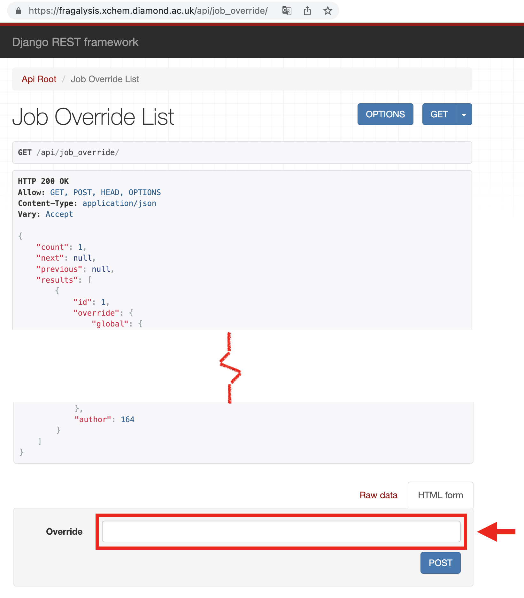

##################
Squonk Integration
##################

..  epigraph::

    The Data Manager is the core of `Squonk2`_ products. It provides a managed
    environment for data and allows execution of applications and jobs that use that
    data to derive new data.

Fragalysis can utilise the Squonk2 Data Manager providing data to the platform against
which select **Jobs** can be executed. The Data Manager is a Kubernetes-based service
that provides authenticated access to Data, Jobs and an Accounting Server to track
Job execution and file-storage usage.

*************
Configuration
*************

Configuring Fragalysis to interact with Squonk requires the satifaction of a number of
prerequisites: -

1.  A dedicated **Organisation** and Organisation **User** need to be created in Squonk
    (this is not covered in these notes)
2.  Users needing to run Jobs will need the ``squonk-user`` **Role** in Keycloak
    (this is not covered in these notes)
3.  A number of Fragalysis container **Environment variables** need to be set
4.  Someone will need to select the Jobs that are to be offered and then create and load
    a **Job Override** definition

Environment Variables
=====================

To connect to a suitably configured Squonk service (see items 1 and 2) the following
environment variables need to be provided in the Fragalysis container: -

==========================  ============================================================
Variable                    Description
==========================  ============================================================
OIDC_AS_CLIENT_ID           The client ID of the Squonk Account Server, as known to Keycloak
OIDC_DM_CLIENT_ID           The client ID of the Squonk Data Manager, as known to Keycloak
SQUONK2_DMAPI_URL           The URL of the Squonk Data Manager REST API, e.g.
                            ``https://example.com/data-manager-api``
SQUONK2_ASAPI_URL           The URL of the Squonk Account Server REST API, e.g.
                            ``https://example.com/account-server-api``
SQUONK2_UI_URL              The URL of the Squonk UI, e.g. ``https://example.com/ui``
SQUONK2_ORG_OWNER           The owner (**User**) of the Squonk Organisation created for
                            this Fragalysis Stack. Typically ``fragalysis``
SQUONK2_ORG_OWNER_PASSWORD  The password for the Squonk Organisation **User**
SQUONK2_ORG_UUID            The Squonk UUID of the Organisation assigned to this
                            Fragalysis Stack, e.g. ``org-00000000-1234-1234-1234-123412341234``
SQUONK2_PRODUCT_FLAVOUR     The *flavour* of the Squonk product to use. One of
                            ``BRONZE``, ``SILVER``, ``GOLD``
SQUONK2_SLUG                A short string used to correlate objects created in Squonk
                            with this Fragalysis Stack. The string is truncated to 10
                            characters. You might wish to distinguish the stack from others
                            with slugs like ``staging``, ``production``, ``dev-a`` etc.
                            The slug must be unique amongst all stacks using the same
                            Squonk and should comply with the `RFC 1035`_ naming style.
SQUONK2_UNIT_BILLING_DAY    The day of the month on which the Squonk billing cycle starts.
                            A number with the value ``1`` to ``28``.
==========================  ============================================================

The Job Override
================

The **Job Override** is a JSON document that defines the Jobs that are to be offered by
the Fragalysis Stack from the ``/api/job_override`` endpoint.

By default a stack has no over-rides installed and the initial
response will present the user with an empty list. New over-rides are loaded into
Fragalysis by an authenticated user visiting the 
``/api/job_override`` endpoint in a web browser. The user will be presented with the
list of over-rides (which may be empty) and can paste the content of new one
in the **Override** field of the ``POST`` dialogue at the bottom of the page
(you mau need to scroll down to see it): -

Clients, especially the Fragalysis Stack front-end, will use the ``/api/job_override``
endpoint to retrieve the "current" (latest) over-ride and present the Jobs it refers to
to the user for selection and execution.

..  epigraph::

    ``/api/job_override`` returns a list of overrides, with the first entry in the list
    representing the most recent override that has been loaded.

The *latest* official (complete) job override is maintained in the `backend`_ repository
in the directory ``viewer/squonk/``. Select one of these files to load into
each new installation.

#######################
Getting Job Definitions
#######################

Once the above pre-requisites are satisfied a client (like the Fragalysis Stack Front End)
would issue a **GET** to ``/api/job_override``. This will provide the client with
the list of jobs and details of how to map Fragalysis variables to each job variable.

Job's are identified in the override ``fragalysis-jobs`` list with the properties
``job_collection``, ``job_name`` and ``job_version``.

The client can obtain the Squonk job definitions for a given job by issuing
a **GET** to ``/api/job_config``, and provide the collection, name and version of the job
to extract. For example, the ``fragmenstein-combine`` job can be obtained from Fragalysis
with a **GET** at ``/api/job_config?job_collection=fragmenstein&job_name=combine&job_version=1.0.0``.

###############
Executing a Job
###############

Once the job variables have been set the client can execute the job by issuing a **POST**
to ``/api/job_request``, after first calling ``/api/job_file_transfer`` so that
files referred to by the Job can be pre-loaded into Squonk. A **GET** from the
same endpoint will return the state of the running Job.

..  toctree::
    :maxdepth: 2
    :caption: Further reading

    exposing-new-jobs

.. _backend: https://github.com/xchem/fragalysis-backend  
.. _rfc 1035: https://tools.ietf.org/html/rfc1035
.. _squonk2: https://squonk.informaticsmatters.org
